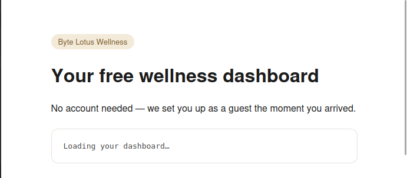
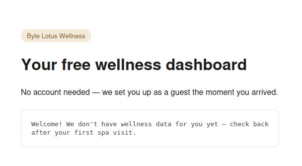
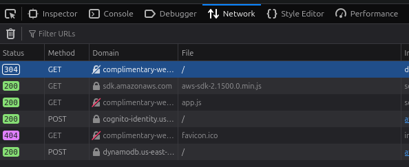
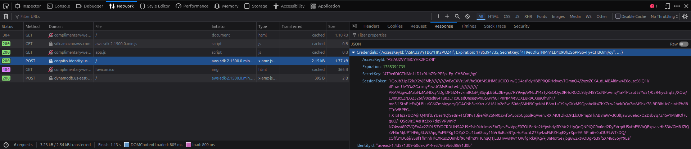
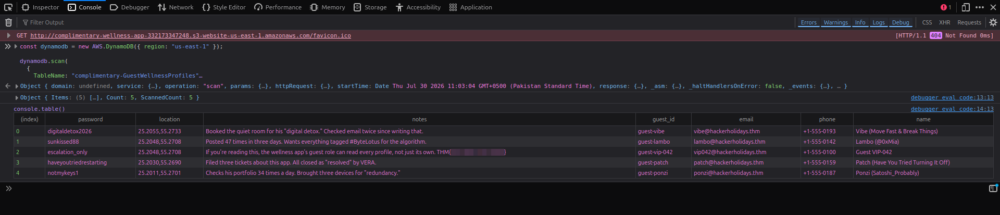

+++
title = 'Complimentary | TryHackMe Room Writeup'
date = '2026-07-30T11:30:00+05:00'
lastmod = '2026-07-30T11:44:55+05:00'
draft = false
description = 'A beginner-friendly walkthrough of Complimentary, an AWS cloud security challenge involving Cognito guest credentials and an over-permissive DynamoDB role.'
categories = ['Writeups']
tags = ['TryHackMe', 'AWS', 'Cloud Security', 'Amazon Cognito', 'DynamoDB', 'Hacker Holidays']
topics = ['tryhackme', 'cloud-security']
toc = true
image = 'images/room-header.png'
+++

Welcome to my writeup for the TryHackMe room **[Complimentary](https://tryhackme.com/room/hh-complimentary-05e0b604)**, part of the **Hacker Holidays** series. This was a short AWS cloud security challenge about tracing guest credentials in a web application and using an over-permissive role to read data belonging to other guests.

> **Spoiler warning:** This walkthrough reveals the room's solution path, but the final flag is masked.


The room provided a link to a wellness dashboard hosted as a static website in an Amazon S3 bucket. The objectives were to:

- identify the AWS mechanism issuing credentials behind the scenes;
- use those credentials to retrieve more than my own record from DynamoDB;
- find the flag in another guest's data.

## Exploring the Wellness Dashboard

When I opened the site, the dashboard briefly displayed a loading message.



It then welcomed me as a guest but said that it did not have any wellness data for me yet.



There was no login form or visible functionality to test, so I opened the browser's developer tools and checked the **Network** tab to see what the page was doing in the background.



Two requests immediately stood out:

- the page loaded an AWS SDK directly in the browser;
- `app.js` made requests to Amazon Cognito and DynamoDB.

## Inspecting the Application Code

Opening `app.js` revealed the application's AWS configuration and the logic used to load each guest's profile:

```javascript
const IDENTITY_POOL_ID =
  "us-east-1:836c0949-292d-485b-b532-52d5ca7bb688";
const AWS_REGION = "us-east-1";
const TABLE_NAME = "complimentary-GuestWellnessProfiles";

AWS.config.region = AWS_REGION;
AWS.config.credentials = new AWS.CognitoIdentityCredentials({
  IdentityPoolId: IDENTITY_POOL_ID,
});
```

The application was using an **Amazon Cognito Identity Pool** to give unauthenticated visitors temporary AWS credentials. It also stored a randomly generated guest ID in the browser:

```javascript
function guestId() {
  let id = localStorage.getItem("byteLotusGuestId");
  if (!id) {
    id = "guest-" + Math.random().toString(36).slice(2, 10);
    localStorage.setItem("byteLotusGuestId", id);
  }
  return id;
}
```

After Cognito returned the credentials, the page created a DynamoDB client and requested one item whose `guest_id` matched the value in local storage:

```javascript
AWS.config.credentials.get(function (err) {
  if (err) {
    console.error("Could not fetch guest credentials:", err);
    return;
  }

  const dynamodb = new AWS.DynamoDB({ region: AWS_REGION });
  dynamodb.getItem(
    {
      TableName: TABLE_NAME,
      Key: { guest_id: { S: guestId() } },
    },
    function (err, data) {
      if (err) {
        console.error("Could not load dashboard:", err);
        return;
      }
      renderDashboard(data.Item);
    }
  );
});
```

This explained the empty dashboard. My browser had generated a new guest ID, but the table did not contain a matching record.

It also revealed everything needed to interact with the backend:

- the Cognito Identity Pool ID;
- the AWS region;
- the DynamoDB table name;
- an initialized AWS SDK client with temporary credentials.

## Tracing the Guest Credentials

The Network tab confirmed what the source code suggested. The Cognito request returned an identity ID together with a temporary access key, secret access key, session token, and expiration time.



These credentials were not a permanent AWS key accidentally embedded in JavaScript. Cognito was intentionally issuing short-lived credentials to unauthenticated visitors. The security issue was the permissions attached to the guest role: the application only needed to retrieve the current guest's record, but the role also allowed a broader DynamoDB operation.

## Scanning the DynamoDB Table

Because the page had already initialized the AWS SDK and obtained credentials, I could reuse them from the browser console. I created a DynamoDB client and called `scan` against the table (after consulting ChatGPT since I don't have experience with the AWS SDK):

```javascript
const dynamodb = new AWS.DynamoDB({ region: "us-east-1" });

dynamodb.scan(
  {
    TableName: "complimentary-GuestWellnessProfiles",
  },
  (err, data) => {
    if (err) {
      console.error(err);
      return;
    }

    console.log(data);
    console.table(
      data.Items.map((item) =>
        AWS.DynamoDB.Converter.unmarshall(item)
      )
    );
  }
);
```

`scan` reads every accessible item in a table rather than looking up one specific key. The request succeeded and returned all five guest profiles, including names, contact details, notes, and passwords. One guest's notes contained the flag.



```text
THM{[REDACTED]}
```

That completed all three objectives: Cognito was the credential-issuing mechanism, its unauthenticated role allowed the DynamoDB scan, and another guest's record contained the flag.

## Why the Exploit Worked

The dashboard's interface suggested that each visitor could see only their own record, but that restriction existed only in the client-side code:

```text
Browser generates a guest ID
            ↓
Client calls GetItem for that ID
            ↓
Dashboard appears limited to one profile
```

Nothing in the AWS permissions enforced that boundary. Since the Cognito guest role allowed `dynamodb:Scan`, a visitor could ignore the application's intended `GetItem` request and ask DynamoDB for the entire table instead:

```text
Unauthenticated Cognito identity
            ↓
Temporary AWS credentials
            ↓
Over-permissive DynamoDB guest role
            ↓
Scan returns every guest profile
```

This is a good example of why client-side behavior is not an authorization control. Users can modify browser code, call SDK methods directly, and construct requests that the interface never exposes.

## Takeaways

Complimentary was an easy room, but it demonstrated several important AWS security lessons:

- temporary credentials must still follow the principle of least privilege;
- unauthenticated Cognito identities should receive only the permissions they genuinely require;
- authorization must be enforced by the backend, not by a key selected in client-side JavaScript;
- sensitive data such as passwords should not be stored in plaintext;
- DynamoDB permissions should be scoped to the required actions, resources, and items wherever possible;
- broad operations such as `Scan` should not be available to a public guest role unless absolutely necessary.

The main lesson is that the application *requesting* only one guest's record did not mean the AWS role was limited to that record. Once the browser received credentials with excessive permissions, the apparent per-user boundary disappeared.

And we're done!
