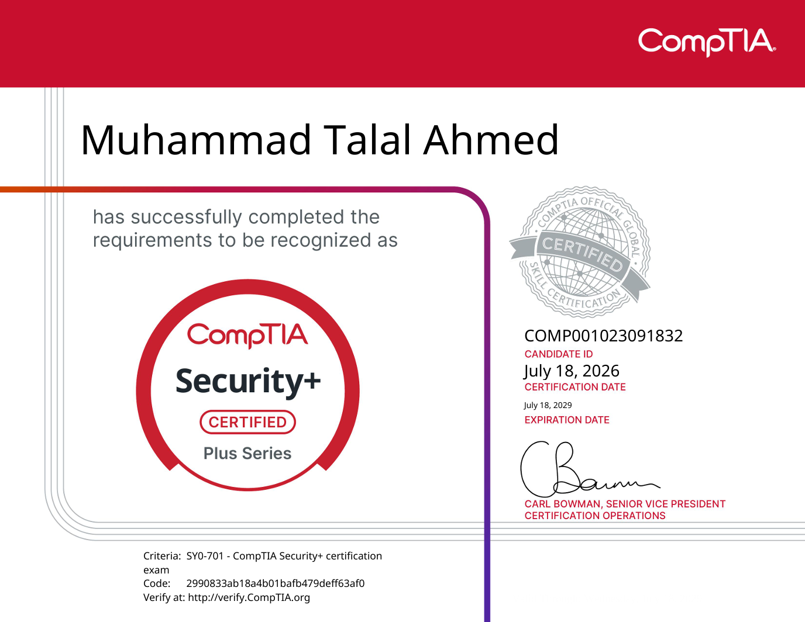

+++
title = 'How I Passed the CompTIA Security+ Exam'
date = '2026-07-24T00:00:00+05:00'
lastmod = '2026-07-24T00:00:00+05:00'
draft = false
description = 'How I prepared for and passed the CompTIA Security+ SY0-701 exam, including the resources I used, difficult topics, and advice for future candidates.'
categories = ['Security']
tags = ['CompTIA', 'Security+', 'Certification', 'Exam Preparation']
toc = true
image = 'images/msedge_WYNUk94JEi.png'
+++

I recently passed the **CompTIA Security+ SY0-701 exam** with a score of **795**.

I prepared for around a month, and although I was nervous before the exam, it ended up being easier than I expected. The questions were not necessarily simple, but most of them felt manageable once I slowed down and carefully read what was being asked.

## My Background Before Security+

Before starting my Security+ preparation, I already had some practical cybersecurity experience through personal projects and labs.

I had worked with tools such as:

* Wazuh
* Splunk
* ELK
* pfSense
* Wireshark
* Sysmon
* Windows and Linux logs

I had also completed the Google Cybersecurity Professional Certificate and the TryHackMe SOC Level 1 learning path.

This background helped with topics such as networking, SIEM monitoring, incident response and log analysis. However, Security+ covers a much wider range of topics, so I still had to study areas such as governance, risk management, cryptography, security architecture and compliance.

## Resources I Used

I initially started with a Security+ course by InfoSec available through Coursera. It gave me a useful introduction, but I eventually realized that it did not cover every exam objective in enough detail.

The most helpful resource for me was **Professor Messer’s free Security+ video course**. His videos closely follow the official SY0-701 exam objectives and explain the topics without adding too much unnecessary information.

I kept the official CompTIA exam objectives open while studying and used them as a checklist. This helped me identify topics that I had missed or did not fully understand.

For performance-based questions, I watched **Cyberkraft’s PBQ walkthroughs**. These videos helped me understand how practical questions might be structured, including firewall rules, network diagrams, command-line tasks and incident-response scenarios.

I also completed multiple practice exams. Instead of only looking at my score, I reviewed every incorrect answer and tried to understand why the other options were wrong.

## Topics I Found Difficult

Some of the most confusing parts of the exam preparation were topics where several terms sounded very similar.

These included:

* Data owner, controller, processor and custodian
* Memorandums of understanding, service-level agreements and statements of work
* Risk acceptance, risk exceptions and risk exemptions
* SPF, DKIM and DMARC
* Exposure factor, annual rate of occurrence and annualized loss expectancy
* SNMP traps, NetFlow and different monitoring protocols

Creating short notes and comparison tables helped me separate these concepts.

## The Exam Experience

I took the exam online through Pearson VUE.

The multiple-choice questions often included two answers that both appeared reasonable. In those situations, I tried to identify the answer that most directly addressed the specific wording of the question.

The performance-based questions appeared at the beginning of the exam. I looked at them briefly, completed the ones I understood and returned to the more difficult ones after finishing the multiple-choice section.

One unexpected problem was that my electricity went out during the exam.

Thankfully, my laptop battery lasted, and my internet connection continued working long enough for me to complete the test. It was a stressful experience, so I would strongly recommend using backup power and a reliable internet connection when taking an online exam, especially in a country where power outages are common.

## My Advice for Future Candidates

My main advice is to use the official exam objectives as your primary checklist.

Do not rely on a single course or assume that completing one video series means you are fully prepared. Take practice exams, review your mistakes and spend extra time on topics where the terminology feels confusing.

It is also important to understand why an answer is correct rather than simply memorizing it. Security+ questions often test whether you can apply a concept to a scenario.

Finally, do not panic if you feel uncertain during the exam. I was not completely confident while answering every question, but I still passed with a score of 795.

## What Comes Next

Passing Security+ gave me a stronger foundation in cybersecurity and confirmed that I understood the core concepts expected from an entry-level security professional.

My next goal is to continue developing practical SOC and incident-response skills while preparing for the **Microsoft SC-200: Security Operations Analyst** certification.
