+++
title = 'Infinity Pool | TryHackMe Room Writeup'
date = '2026-08-07T09:00:00+05:00'
lastmod = '2026-08-07T12:00:00+05:00'
draft = false
description = 'A walkthrough of Infinity Pool, a TryHackMe Boot2Root room involving command injection, exposed internal configuration, FreePBX, and a root-owned automation API.'
categories = ['Writeups']
tags = ['TryHackMe', 'Web Security', 'Command Injection', 'FreePBX', 'Linux Privilege Escalation', 'Hacker Holidays']
topics = ['tryhackme']
keyClues = ['/internal/netcheck', '/api/config', 'FreePBXUCPTemplateCreator', '/jobs/export', 'report command injection']
toc = true
image = 'images/room-banner.png'
+++

Welcome to my writeup for the TryHackMe room **[Infinity Pool](https://tryhackme.com/room/hh-infinitypool-5b3548af)**, part of the **Hacker Holidays** series. The room gave me a target URL and almost nothing else. What began with a hidden ping utility eventually became a chain through three loopback-only services, exposed FreePBX credentials, an automation key, and a second command injection running as root.

This was a tough room, especially once I reached privilege escalation, but following each piece of leaked information eventually brought the whole path together.

> **Spoiler warning:** This walkthrough reveals the complete solution path, but both flags and my VPN address are masked.


The objectives were simple:

- find the user flag;
- find the root flag.

## Finding the Hidden Status Tool

The supplied URL opened a sparse Byte Lotus landing page. There was no login form or obvious interactive feature to investigate.

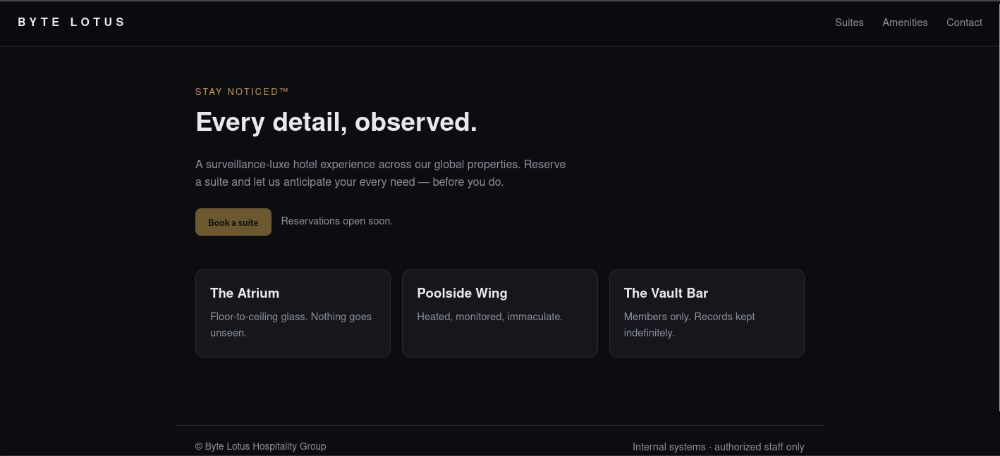

I checked the page source and found a reference to `/static/app.js` near the end of the document.

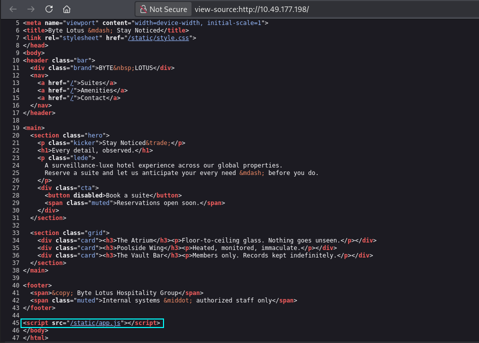

The JavaScript file contained only a few comments, but one of them disclosed a staff connectivity tool at `/status`. It also explained that the page posted to a legacy `/internal/netcheck` handler.

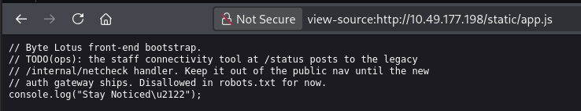

Opening `/status` displayed a **Sister-property connectivity** tool with a single field for a hostname or IP address.

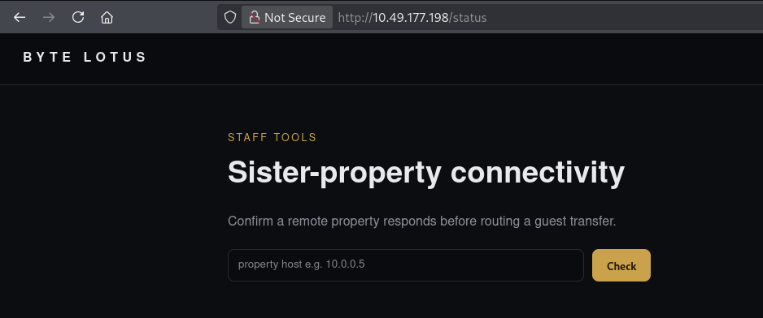

I entered `127.0.0.1` first. The response contained normal `ping` output, confirming that the server passed my input to a system utility and returned its output to the page.

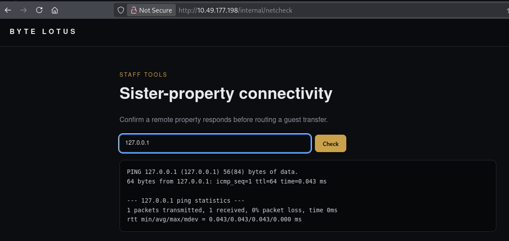

## Command Injection as web

Because the application appeared to build a shell command around my input, I added a semicolon followed by `whoami`:

```text
127.0.0.1;whoami
```

The ping still ran, but the bottom of the response now contained `web`.

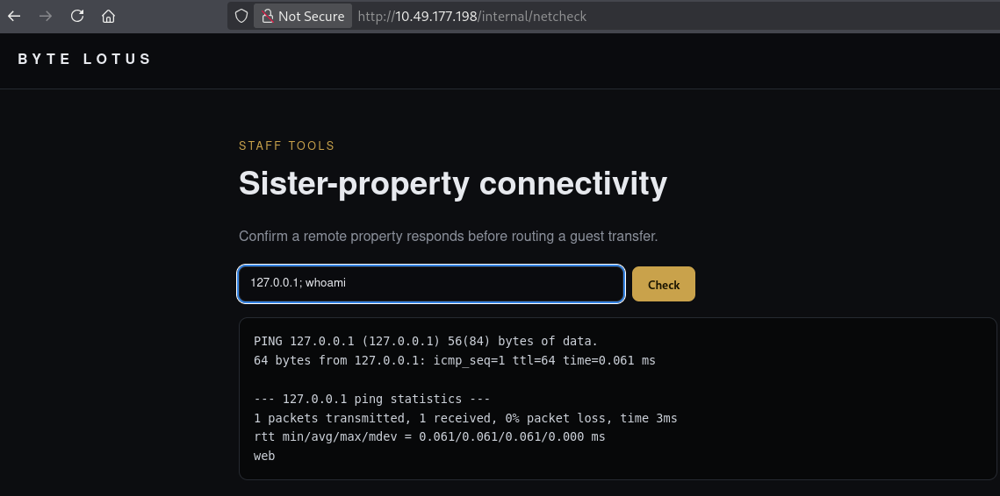

That confirmed OS command injection in the legacy netcheck handler. I started a listener on my machine using Penelope:

```bash
python3 penelope.py
```

My first reverse-shell attempt used ordinary spaces. The page passed pieces of the payload to `ping` as arguments, so I experimented with how the handler parsed the value.

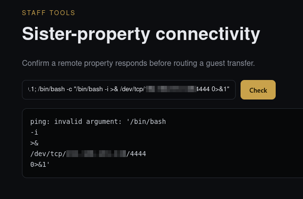

The target connected back to my listener and gave me a shell as `web`. The first flag was waiting in the user's home directory:

```bash
cat /home/web/user.txt
```

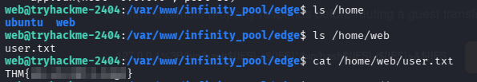

## Enumerating the Internal Services

The user flag was straightforward; privilege escalation was the difficult part. From `/var/www/infinity_pool/edge`, I inspected the parent directory and found two neighboring applications:

```bash
ls -la ..
```

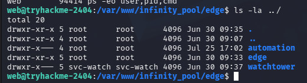

I then compared those directories with the process list and listening ports:

```bash
ps -eo user,pid,cmd
ss -lntp
```

Three local services stood out:

| Service | Address | Process owner | Why it mattered |
| --- | --- | --- | --- |
| Watchtower | `127.0.0.1:3000` | `svc-watch` | Exposed operational configuration |
| Automation | `127.0.0.1:9000` | `root` | Any code execution here would be privileged |
| Apache / FreePBX | `127.0.0.1:8080` | `asterisk` | Hosted the FreePBX User Control Panel |

The process list shortened `svc-watch` to `svc-wat+`, but the directory ownership revealed the full account name.

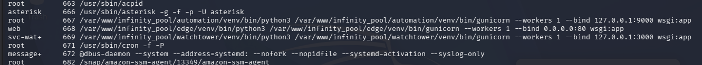

All three services listened only on loopback, so they were not reachable from my browser directly. They were still accessible from the `web` shell.

## Leaking Credentials from Watchtower

I started with Watchtower and queried random endpoints until I found its configuration endpoint:

```bash
curl -s http://127.0.0.1:3000/api/config
```

The JSON response disclosed the next part of the chain:

```json
{
  "automation_endpoint": "http://127.0.0.1:9000",
  "note": "internal network only - do not expose",
  "ops_note": "UCP still on default template creds (FreePBXUCPTemplateCreator) -- ROTATE.",
  "telephony_pass": "$t4yN0t1c3d_2026",
  "telephony_portal": "http://127.0.0.1:8080/ucp",
  "telephony_user": "FreePBXUCPTemplateCreator"
}
```

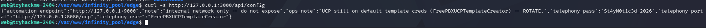

I now had credentials for the FreePBX User Control Panel and confirmation that the root-owned Automation service was listening on port `9000`.

## Tunneling into FreePBX UCP

Requesting `/ucp` on port `8080` returned HTML, so I wanted to use the application from my own browser. I generated an SSH key, added its public key to the `web` user's `~/.ssh/authorized_keys`, and created a local port forward:

```bash
ssh -i ./infinity_pool -L 8080:127.0.0.1:8080 web@<TARGET_IP>
```

With the tunnel open, I browsed to:

```text
http://127.0.0.1:8080/ucp/
```

That brought up the FreePBX User Control Panel login page.

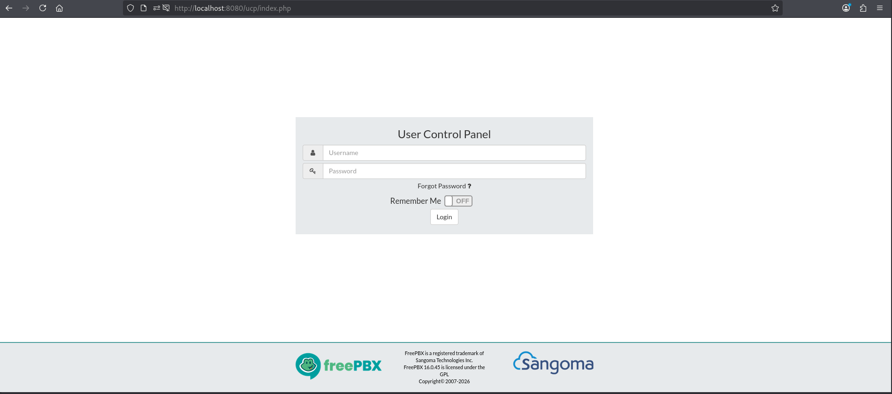

I entered the credentials from the Watchtower response and signed in.

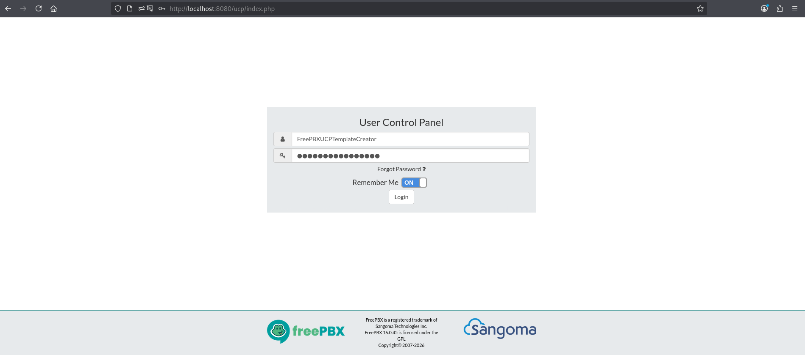

The account opened on an empty dashboard. I created a dashboard and explored the available widgets.

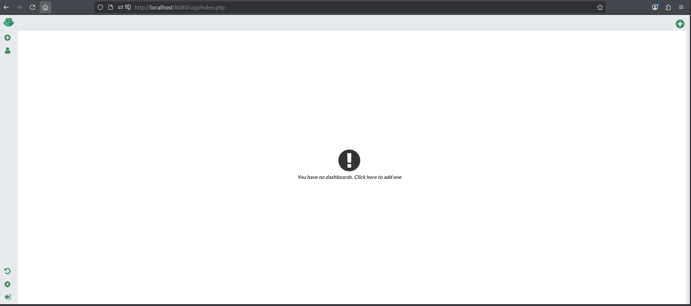

Under the voicemail widgets was one named `FreePBXUCPTemplateCreator`. Adding it exposed a single inbox entry.

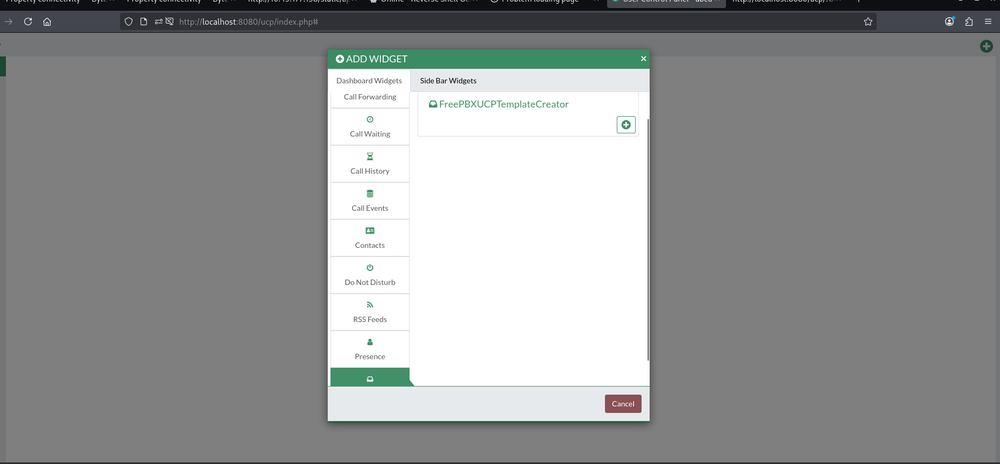

The caller ID on that entry contained an **Automation Key** for the service on port `9000`.

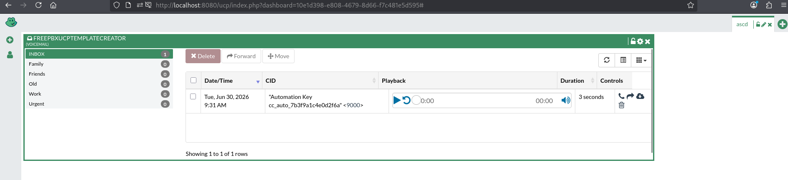

## Understanding the Automation API

Back in the target shell, I requested the Automation service's `/health` endpoint after trying many other endpoints:

```bash
curl -s http://127.0.0.1:9000/health
```

Besides returning the service status, the response documented an authenticated endpoint:

```json
{
  "endpoints": {
    "GET /health": "service status",
    "POST /jobs/export": {
      "auth": "Authorization: Bearer <automation key>",
      "body": { "report": "<report name>" },
      "desc": "archive the latest data export"
    }
  },
  "runs_as": "root",
  "service": "automation",
  "status": "ok"
}
```

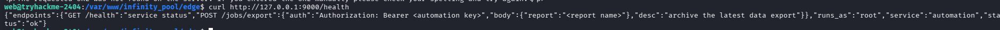

I stored the key recovered from FreePBX and sent a normal export request first:

```bash
KEY='cc_auto_7b3f9a1c4e0d2f6a'

curl -s -X POST \
  -H "Authorization: Bearer $KEY" \
  -H "Content-Type: application/json" \
  http://127.0.0.1:9000/jobs/export \
  -d '{"report":"test"}'
```

The API returned both the command it had constructed and the command's output:

```text
tar czf /var/automation/exports/test.tgz /var/automation/data 2>&1
```

This was the vulnerability. The service inserted the `report` value directly into a shell command without quoting or validation. Although the endpoint created a compressed tar archive, the problem was not archive extraction or ZIP Slip; it was command injection through the output filename.

## Root Command Execution

I placed semicolons inside the report name to terminate the intended `tar` command and run `id`:

```bash
curl -s -X POST \
  -H "Authorization: Bearer $KEY" \
  -H "Content-Type: application/json" \
  http://127.0.0.1:9000/jobs/export \
  -d '{"report":"test; id;"}'
```

The response showed how my input had changed the command and returned the result:

```text
uid=0(root) gid=0(root) groups=0(root)
```

Because the Gunicorn service itself ran as root, the injected command inherited root privileges. Replacing `id` with a read of the final flag completed the room:

```bash
curl -s -X POST \
  -H "Authorization: Bearer $KEY" \
  -H "Content-Type: application/json" \
  http://127.0.0.1:9000/jobs/export \
  -d '{"report":"test; cat /root/root.txt;"}'
```

The root flag appeared inside the API's `output` field.

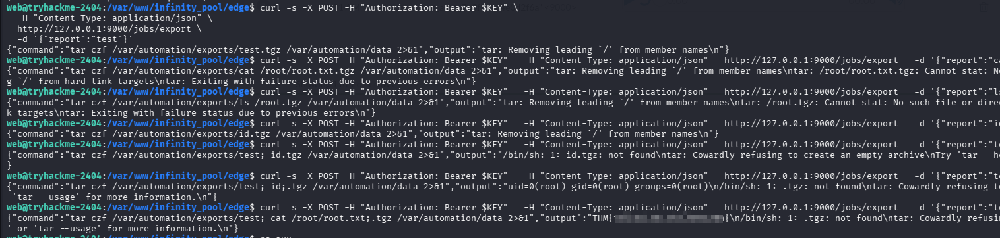

## Why the Exploit Chain Worked

No single public page exposed the root flag. The route depended on following information across several trust boundaries:

```text
/static/app.js reveals /status
              ↓
Command injection in /internal/netcheck
              ↓
Reverse shell as web and local service enumeration
              ↓
Watchtower /api/config leaks FreePBX credentials
              ↓
SSH tunnel into FreePBX UCP
              ↓
Voicemail widget leaks the Automation key
              ↓
Root-owned /jobs/export interpolates report into a shell command
              ↓
Command execution as root
```

The loopback bindings reduced external exposure, but they did not form a meaningful security boundary after the Edge application was compromised. Watchtower then exposed the credentials needed for FreePBX, and FreePBX exposed the bearer token needed for Automation.

## Takeaways

Infinity Pool reinforced a few practical lessons:

- inspect page source and referenced JavaScript even when a site appears static;
- never pass user-controlled input to a shell command through string concatenation;
- enumerate neighboring directories, processes, and loopback listeners after gaining a foothold;
- do not expose passwords or service locations through unauthenticated configuration endpoints;
- treat voicemail, dashboard widgets, and other secondary interfaces as places where secrets can leak;
- avoid running web services as root, especially when they invoke system utilities;
- validate report names against a strict allowlist and call `tar` without a shell.

This was one of the tougher rooms in the series for me, but it was also a lot of fun. The privilege-escalation route looked confusing at first because the clues were split across three internal applications. Once I treated each service as part of the same system and followed the leaked credentials and tokens in order, the final command injection became surprisingly simple.

And we're done!
