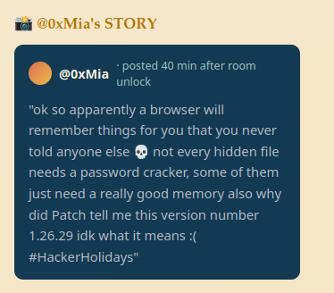
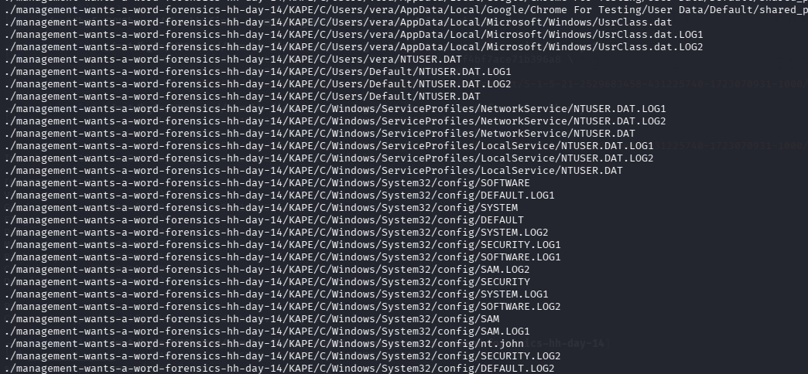
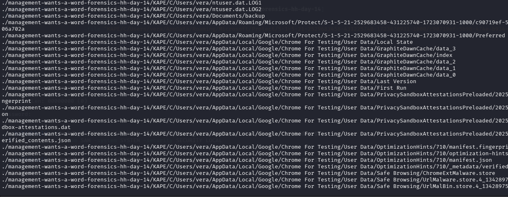
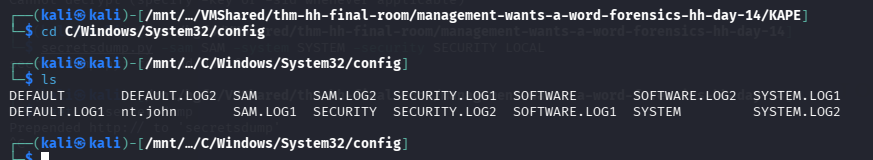
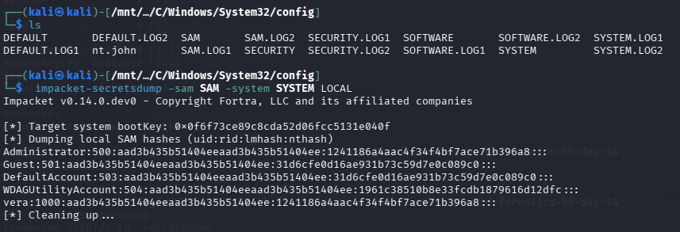
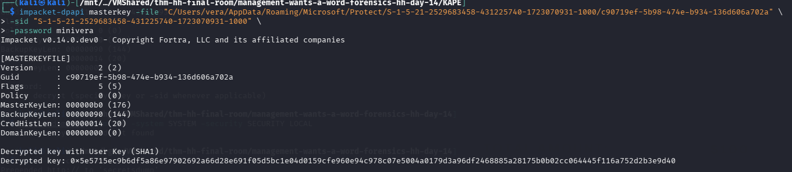
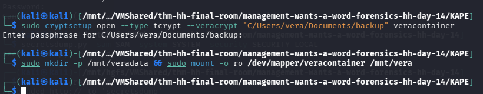
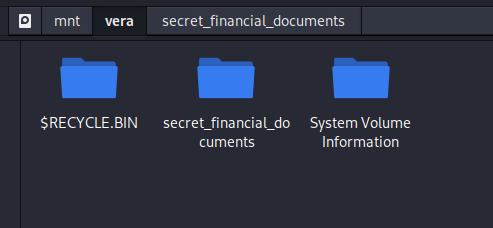
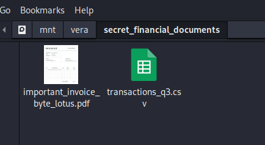
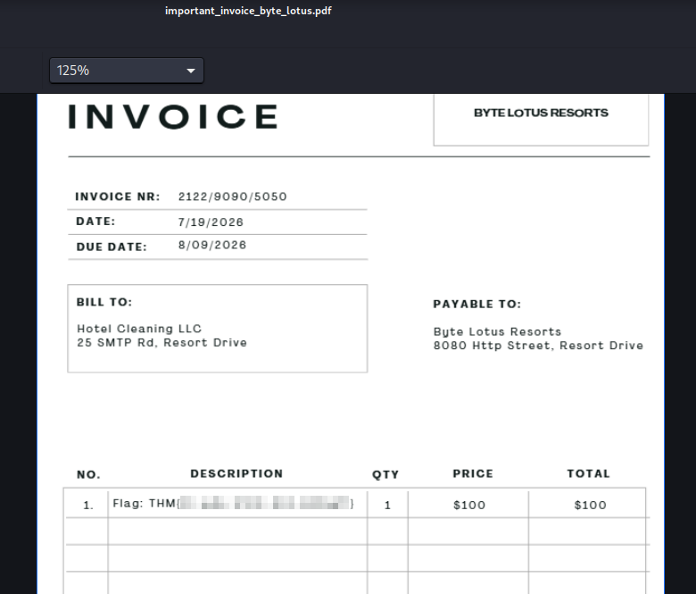

+++
title = 'Management Wants a Word | TryHackMe Room Writeup'
date = '2026-08-09T22:30:00+05:00'
lastmod = '2026-08-09T22:40:00+05:00'
draft = false
description = 'A walkthrough of Management Wants a Word, a TryHackMe Windows forensics room involving a KAPE dump, cracked local credentials, DPAPI master keys, Chrome secrets, and a VeraCrypt container hiding the flag.'
categories = ['Writeups']
tags = ['TryHackMe', 'Windows Forensics', 'DPAPI', 'Chrome', 'VeraCrypt', 'Hacker Holidays']
topics = ['tryhackme']
keyClues = ['KAPE triage', 'SAM & SYSTEM hives', 'NT hash (minivera)', 'DPAPI master key', 'Chrome AES-GCM key', 'Saved Chrome credential', 'VeraCrypt container', 'Invoice flag']
toc = true
image = 'images/room-banner.png'
+++

Welcome to my writeup for the TryHackMe room **[Management Wants a Word](https://tryhackme.com/room/hh-managementwantsaword-6bf3cc41)**, part of the **Hacker Holidays** series. This one was a Windows forensics chain rather than a live web exploit: I had to work through a KAPE dump, recover Vera's local credentials, decrypt her DPAPI material, pull a Chrome password, and finally open a VeraCrypt container that held the flag.

The hint from MIA pointed in the right direction immediately: the browser remembers secrets you never explicitly told it, and the version number she mentioned was a clue that a Chromium-based artifact mattered.

> **Spoiler warning:** This walkthrough reveals the full solution path, but the final flag is masked.




## Triage

The supplied evidence looked like a full Windows triage image extracted with KAPE. The first useful step was just to inventory the dump and confirm the expected Windows artifacts were present.





The presence of `Users`, `Windows`, `SAM`, `SYSTEM`, and Vera's profile told me this was enough to do offline credential recovery. I moved into the registry hive directory and confirmed the hive set was intact, including a file named `nt.john` that looked like a prepared hash-cracking target.



## Cracking Vera's Local Password

With the `SAM` and `SYSTEM` hives in place, I used Impacket's `secretsdump` locally to extract the NT hash for Vera:

```bash
impacket-secretsdump -sam SAM -system SYSTEM LOCAL
```




The hash for `vera` was:

```text
vera:1000:aad3b435b51404eeaad3b435b51404ee:1241186a4aac4f34f4bf7ace71b396a8:::
```

I dropped that into John with RockYou:

```bash
echo 'vera:$NT$1241186a4aac4f34f4bf7ace71b396a8' > nt.john
john --format=nt --wordlist=/usr/share/wordlists/rockyou.txt nt.john
```

John returned the password quickly:

```text
minivera
```

That password was the key to the next layer.

## Decrypting the DPAPI Master Key

The next artifact was Vera's DPAPI master key blob under her Protect directory:

```text
C/Users/vera/AppData/Roaming/Microsoft/Protect/S-1-5-21-2529683458-431225740-1723070931-1000/c90719ef-5b98-474e-b934-136d606a702a
```

I used Impacket's DPAPI helper with the SID and the cracked password:

```bash
impacket-dpapi masterkey -file "C/Users/vera/AppData/Roaming/Microsoft/Protect/S-1-5-21-2529683458-431225740-1723070931-1000/c90719ef-5b98-474e-b934-136d606a702a" \
  -sid "S-1-5-21-2529683458-431225740-1723070931-1000" \
  -password minivera
```



The decrypted master key was:

```text
0x5e5715ec9b6df5a86e97902692a66d28e691f05d5bc1e04d0159cfe960e94c978c07e5004a0179d3a96df2468885a28175b0b02cc064445f116a752d2b3e9d40
```

## Pulling the Chrome Password

The clue about Chrome was the important one. Vera's `Local State` file held the browser's encrypted AES key, and that key was wrapped with DPAPI. Once the master key was available, the browser secret could be recovered offline.

I used a small Python script to extract the Chrome key from `Local State` and decrypt the `Login Data` database. The interesting result was a saved login for the Byte Lotus host:

```text
URL:      http://bytelotus.thm:8080/
Username: VeraSecretVault
Password: Wh4t1sV3raD0inG0nTh1sH0st
```

That was the credential I needed for the encrypted container.

## Opening the VeraCrypt Container

The password pointed to a VeraCrypt volume stored in Vera's documents. I opened it with `cryptsetup` using the VeraCrypt mode:

```bash
sudo cryptsetup open --type tcrypt --veracrypt "C/Users/vera/Documents/backup" veracontainer
sudo mkdir -p /mnt/veradata && sudo mount -o ro /dev/mapper/veracontainer /mnt/vera
```



The mounted volume exposed a small set of folders, including a directory that looked deliberately financial and private.



Inside it, I found the documents that mattered most: an invoice PDF and a CSV export of transactions.



## Finding the Flag

Opening `important_invoice_byte_lotus.pdf` revealed the final flag embedded in the invoice body.



The flag was present in the invoice text, and that closed out the room.

## Takeaways

This room was a good reminder that Windows forensics often works as a chain rather than a single trick. A local NT hash led to a DPAPI master key, that key unlocked Chrome secrets, and the browser secret opened a container with the final evidence.

The main lesson for me was that the obvious path is not always the hard one: once the triage dump was mapped out, the rest was just following each artifact to the next.