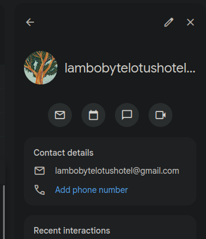
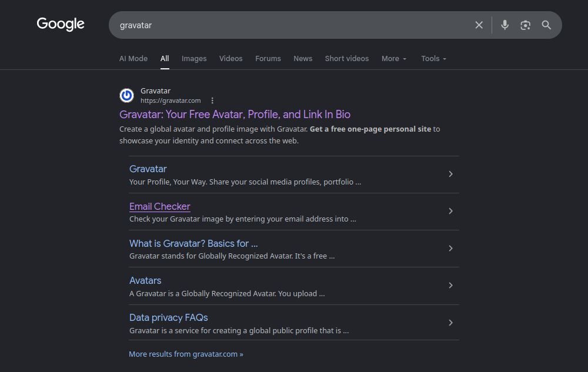
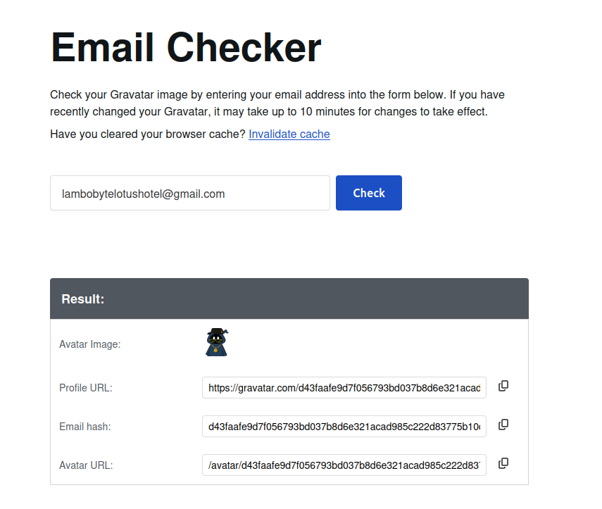
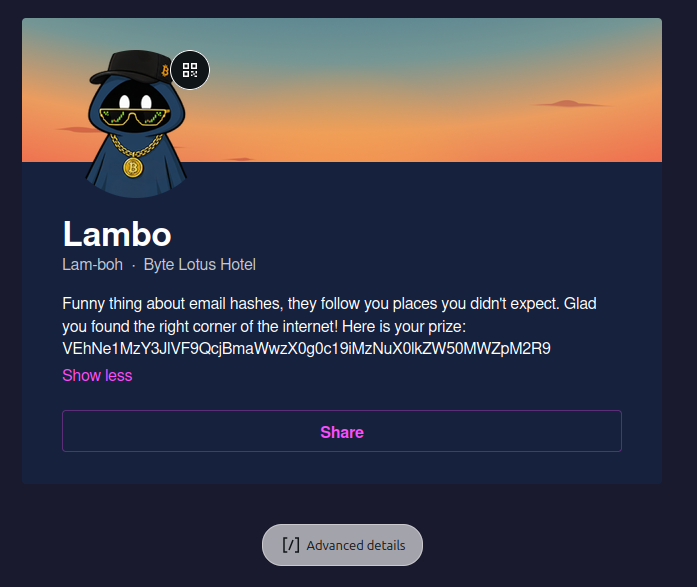
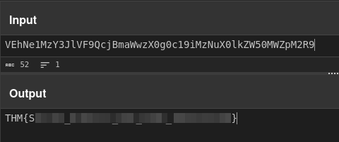

+++
title = 'Overheard at Breakfast | TryHackMe Room Writeup'
date = '2026-08-01T00:00:00+05:00'
lastmod = '2026-08-01T00:00:00+05:00'
draft = false
description = 'A quick OSINT walkthrough of Overheard at Breakfast, a TryHackMe Hacker Holidays room about tracing an email address to a hidden Gravatar profile.'
categories = ['Writeups']
tags = ['TryHackMe', 'OSINT', 'Hacker Holidays', 'Gravatar']
topics = ['tryhackme', 'osint']
toc = true
image = 'images/room-header.png'
+++

Welcome to my writeup for the TryHackMe room **[Overheard at Breakfast](https://tryhackme.com/room/hh-overheardatbreakfast-6f01793c)**, part of the **Hacker Holidays** series. This is a short OSINT challenge that asks us to analyze a conversation, extract its identifying details, locate a hidden account, and retrieve the flag.

> **Spoiler warning:** This walkthrough reveals the room's solution path, but the final flag is masked.


## Reading the Conversation

The room gives us a single file named `conversation.png`, showing a chat between **Ponzi** and **Lambo**.


Most of the conversation is casual, but Lambo reveals two important clues:

- the email address `lambobytelotushotel@gmail.com`;
- a free platform that let users upload a profile and link other media accounts, whose name started with **G**.

Those were the identifying details needed to begin the search.

## Checking the Email Address

I first investigated the Gmail address directly to see whether it exposed any extra information, but that route did not produce anything useful.



The second clue therefore became much more important. I tried to think of a profile platform beginning with **G** that could connect a person's identity across websites and social media accounts.

Then I had an idea: search for exactly what Lambo had described (brilliant, I know 😎).


The result was **Gravatar**.



## Finding the Gravatar Profile

Gravatar associates profiles with identifiers derived from email addresses. The email is normalized by trimming whitespace and converting it to lowercase before it is hashed. Current [Gravatar documentation](https://docs.gravatar.com/rest/hash/) specifies SHA-256 for profile identifiers, although older Gravatar integrations are commonly associated with MD5-based avatar URLs.

I did not need to calculate the identifier manually. Gravatar's email checker accepted the address from the conversation and returned Lambo's avatar, email hash, and profile URL.



Opening the profile revealed the hidden account. Its biography contained a long string that looked like Base64.



## Decoding the Flag

I copied the encoded string into [CyberChef](https://gchq.github.io/CyberChef/) and used the **From Base64** operation. The output was the room flag:



## Takeaways

This room was super easy and super simple, but it demonstrated a useful OSINT pattern: a public email address can act as an identifier across services even when searching the address directly reveals nothing.

The solution came down to extracting both clues from the conversation and using them together:

```text
Email address + profile platform beginning with G
                         ↓
                      Gravatar
                         ↓
                 Hidden public profile
                         ↓
                 Base64-encoded flag
```

It is also a good reminder that email-derived hashes are identifiers, not a way to make a known email address anonymous. Once the platform clue pointed to Gravatar, the hidden profile was straightforward to locate.

Ponzi and Lambo also appear in [The Concierge Knows Too Much](/blog/the-concierge-knows-too-much-tryhackme-writeup/), while [The Brochure](/blog/the-brochure-tryhackme-writeup/) follows another short Hacker Holidays OSINT trail involving public profiles and Base64.

And we're done!
