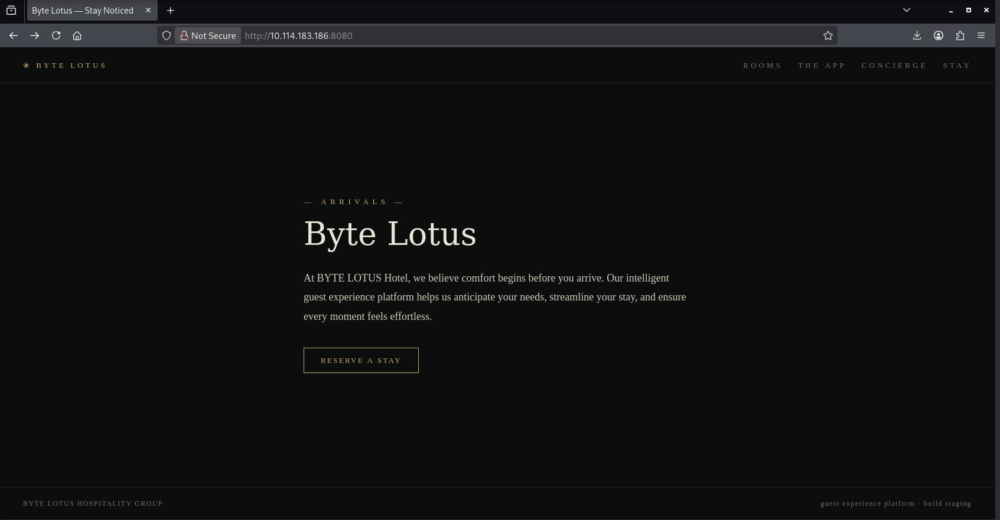
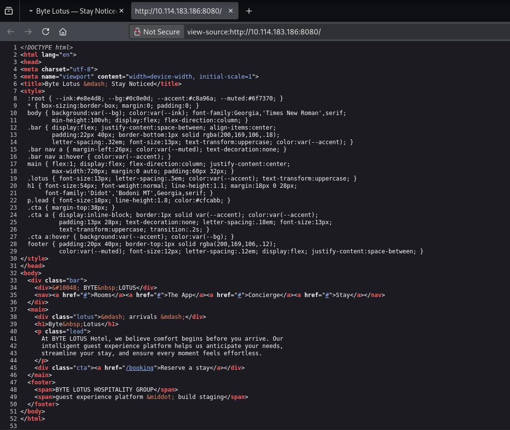
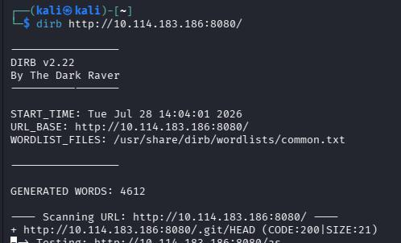
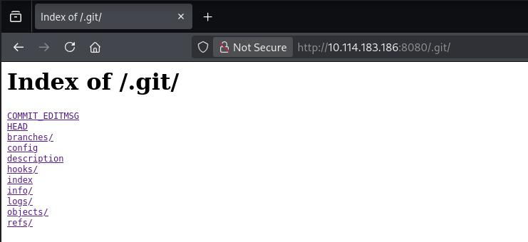
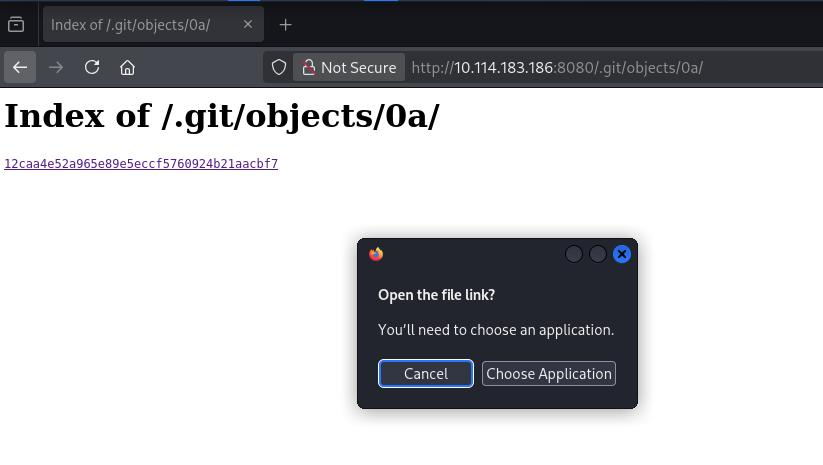
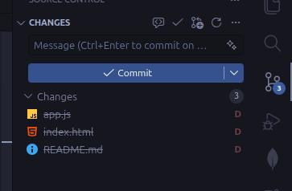

+++
title = 'Room 404 | TryHackMe Room Writeup'
date = '2026-07-28T23:20:00+05:00'
lastmod = '2026-08-07T12:00:00+05:00'
draft = false
description = 'A beginner-friendly walkthrough of Room 404, a TryHackMe web challenge about directory enumeration and an exposed Git repository.'
categories = ['Writeups']
tags = ['TryHackMe', 'Web Security', 'Git', 'Enumeration', 'Hacker Holidays']
topics = ['tryhackme']
keyClues = ['/.git/', '.git/objects/', 'README.md', 'app.js', 'wget -r -np']
toc = true
image = 'images/room-header.jpg'
+++

Welcome to my writeup for the TryHackMe room **[Room 404](https://tryhackme.com/room/hh-room404-804573bf)**, part of the **Hacker Holidays** series. This was a short web challenge that demonstrated how an exposed Git repository can reveal files a developer thought had been deleted.

> **Spoiler warning:** This walkthrough reveals the room's solution path, but the final flag is masked.


## Exploring the Hotel Website

The room provided a link to the Byte Lotus Hotel website.



The page looked polished, but none of its navigation links led anywhere useful. I checked the page source next in case it contained a hidden route, comment, script, or other clue. Apart from the visible page markup, there was nothing interesting there either.



With the obvious checks exhausted, the next step was to enumerate files and directories that were not linked from the page.

## Finding the Exposed Git Repository

I ran [DIRB](https://www.kali.org/tools/dirb/) against the site with its `common.txt` wordlist:

```bash
dirb http://<ipaddress>:8080/ /usr/share/dirb/wordlists/common.txt
```

The scan discovered a publicly accessible `.git` directory.



Opening the directory in the browser confirmed that directory listing was enabled. It exposed the usual Git repository structure, including `HEAD`, `config`, `logs`, `objects`, and `refs`.



I explored these directories manually at first, but there was not much useful information in the plain-text files. The files under `.git/objects/` were also not readable directly in the browser.



That was expected: Git stores repository data as compressed objects rather than ordinary source files. Instead of inspecting each object individually, I downloaded the entire `.git` directory so Git could reconstruct and interpret the repository for me.

## Downloading the Repository

I used `wget` recursively:

```bash
wget -r -np -R 'index.html*' http://<ipaddress>:8080/.git/
```

The options used here were:

- `-r` to download recursively;
- `-np` to prevent `wget` from following links into parent directories;
- `-R 'index.html*'` to reject the directory-listing pages generated by the web server.

Once the download finished, I opened the recovered site folder in Visual Studio Code. Its Source Control view immediately recognized the Git metadata and showed three tracked files as deleted but not committed:

- `app.js`;
- `index.html`;
- `README.md`.



Opening the deleted `README.md` change revealed its previous contents, including the flag:

```text
# Byte Lotus — Guest Experience Platform

Internal staging repository for the guest app and concierge personalization
service. Do not deploy this folder to production.

Staging flag (remove before launch): THM{[REDACTED]}
```

No complicated Git commands were necessary. Once the complete repository metadata was available locally, Visual Studio Code used it to show exactly what had been removed from the working tree.

## Why the Exploit Worked

Deleting a file from a website does not remove it from the site's Git history. The `.git` directory contains the objects and references Git needs to reconstruct tracked files and earlier versions of the project.

In this case, the web server exposed that directory and allowed every part of it to be downloaded:

```text
Exposed .git directory
        ↓
Repository metadata downloaded
        ↓
Git reconstructs deleted files
        ↓
README.md reveals the flag
```

This is why `.git` should never be deployed inside a publicly accessible web root. Blocking directory listings alone is not enough either; if the individual Git files remain reachable, an attacker may still be able to retrieve the repository.

## Takeaways

Room 404 was simple, but it reinforced a useful web-enumeration workflow:

- inspect the page and its source first;
- enumerate unlinked files and directories when the visible site reaches a dead end;
- recognize the standard structure of an exposed Git repository;
- download the complete repository instead of trying to read individual Git objects;
- check deleted and historical files for information that is no longer visible on the live site.

The main lesson is that version-control metadata can expose far more than the current contents of a website. Secrets removed from the working tree may still be recoverable until they are removed from the repository's history and rotated.

And we're done!

> P.S. Apologies for the terrible screenshots quality. I'm currently experimenting with Linux Mint and Flameshot is outputting low-quality images for some reason. I miss ShareX already.
