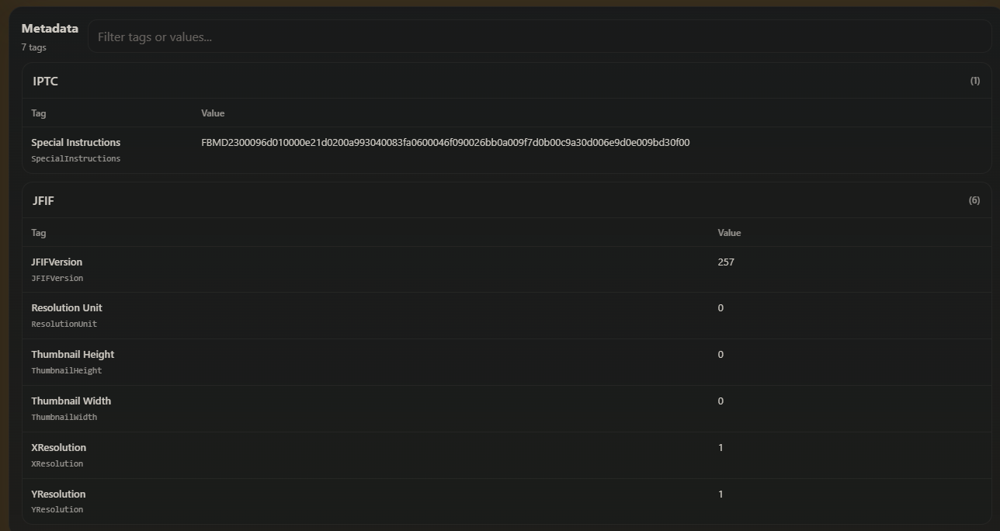
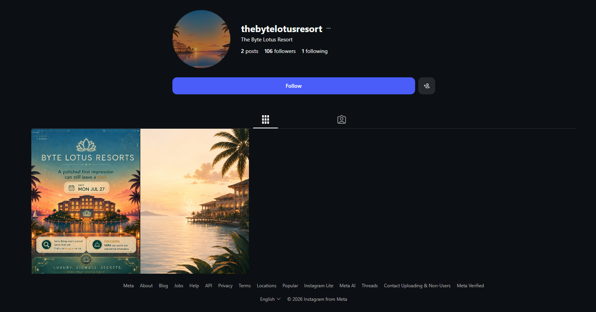
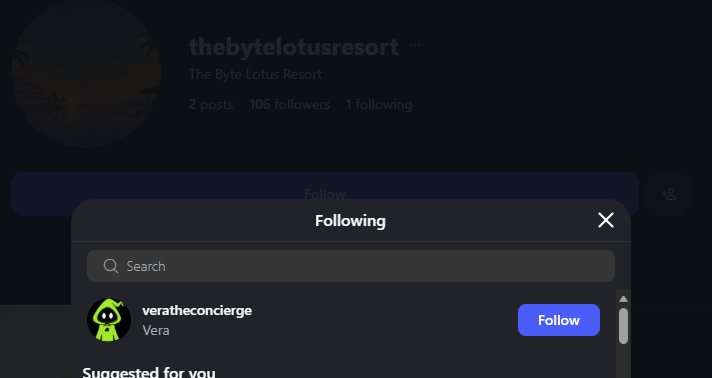
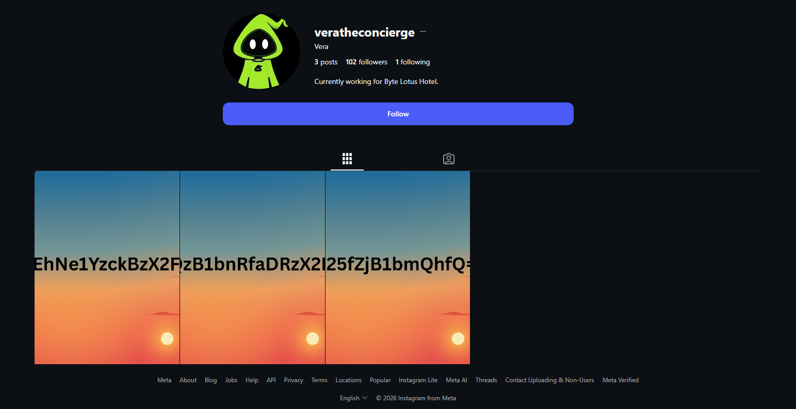
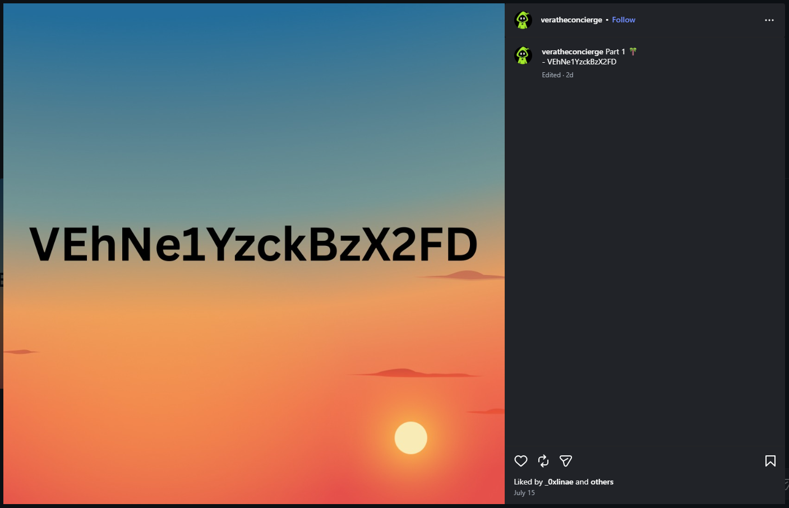
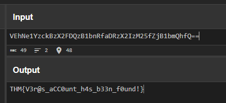
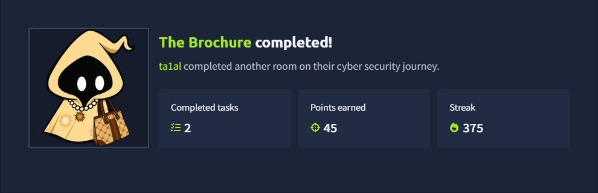

+++
title = 'The Brochure | TryHackMe Room Writeup'
date = '2026-07-25T00:00:00+05:00'
lastmod = '2026-07-25T00:00:00+05:00'
draft = false
description = 'A beginner-friendly OSINT walkthrough of The Brochure, the warmup room for TryHackMe’s Hacker Holiday series.'
categories = ['Writeups']
tags = ['TryHackMe', 'OSINT']
topics = ['tryhackme', 'osint']
toc = true
image = 'images/room-banner.png'
+++

Welcome to my writeup for the TryHackMe room **The Brochure**, an OSINT warmup for the upcoming **Hacker Holiday** series. Hacker Holiday is designed as a free, beginner-friendly introduction to cyber security, with a new self-contained challenge opening every day across topics such as OSINT, web exploitation, cloud security, forensics, and AI prompt attacks.

> **Spoiler warning:** This walkthrough reveals the room's solution path, but the final flag is masked.


The room gives us a single image and asks us to follow its trail.


## Inspecting the Brochure

I started by checking the brochure's metadata. Although the file contained a few fields, including a hash-like value under “Special Instructions,” none of them provided an actionable lead.



That meant the visible contents of the brochure were more important. Two details stood out:

- “Find us on Instagram or not.”
- “Concierge **Vera** can assist you with further information.”

The first clue gave me the platform to investigate, while the second gave me a name to keep in mind.

## Finding the Resort

Searching Instagram led me to `@thebytelotusresort`. The account had only two posts: the same brochure supplied by the room and a photo of a resort by the sea. Neither caption contained a useful clue.



With the posts exhausted, I checked the account's connections. The resort was following only one account: `@veratheconcierge`.



This matched the concierge named on the brochure, so it was the natural next step in the trail.

## Following Vera's Trail

Vera's profile had three posts, each showing part of a Base64-looking string over the same sunset image.



Each post contained a fragment of the string, which I copied down in order from left to right.



Reading the three posts from left to right and joining their fragments produced:

```text
VEhNe1YzckBzX2FDQzB1bnRfaDRzX2IzM25fZjB1bmQhfQ==
```


The character set and `==` padding were strong signs that the value was Base64. Decoding it with [CyberChef](https://gchq.github.io/CyberChef/) revealed the flag:

```text
THM{[REDACTED]}
```



## Takeaways

This was a short room, but it demonstrated a useful OSINT workflow: inspect the original file, follow clues in its visible content, and look beyond posts to an account's public connections. It also reinforced the value of recognising common encodings such as Base64 when a clue is split across multiple sources.



And we're done!
