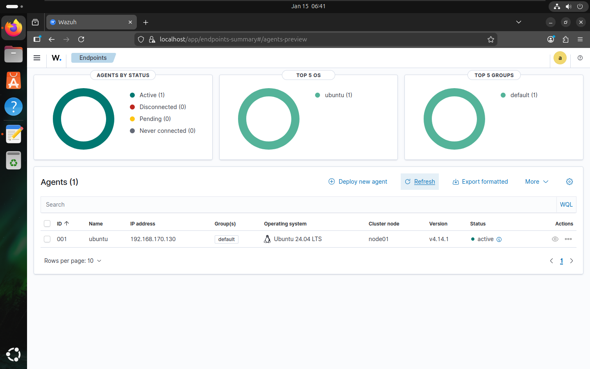
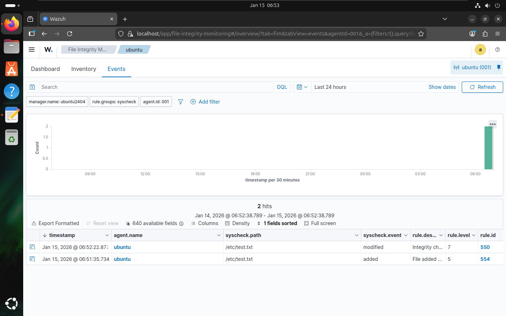
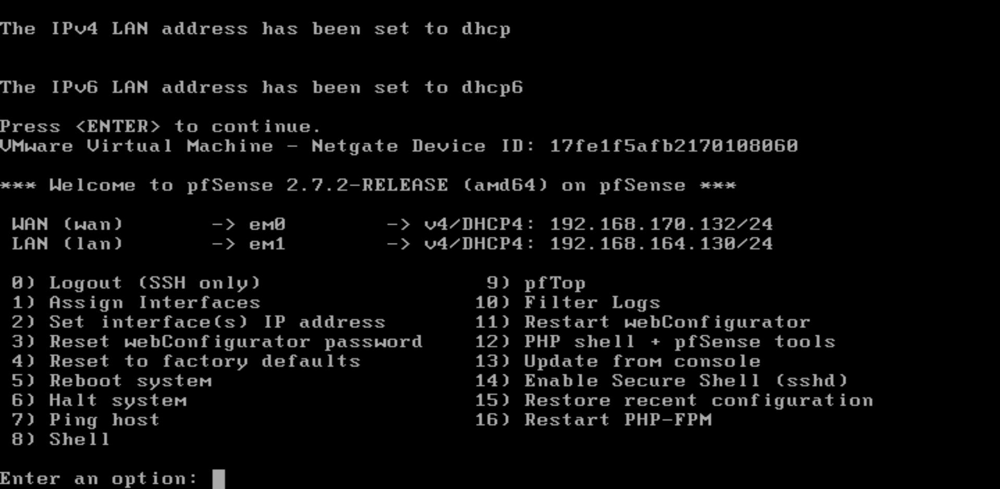
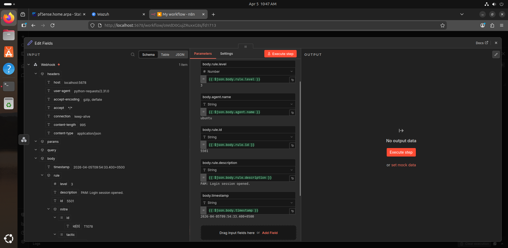
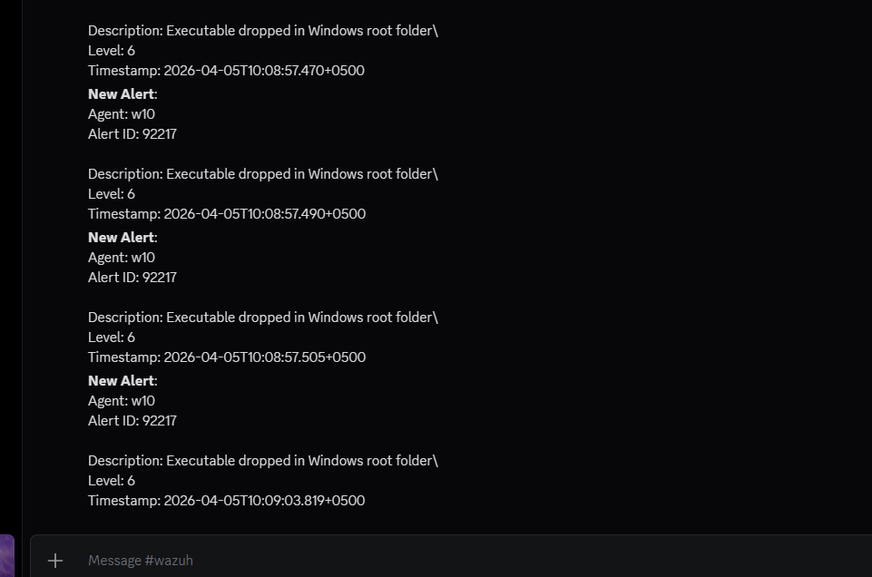
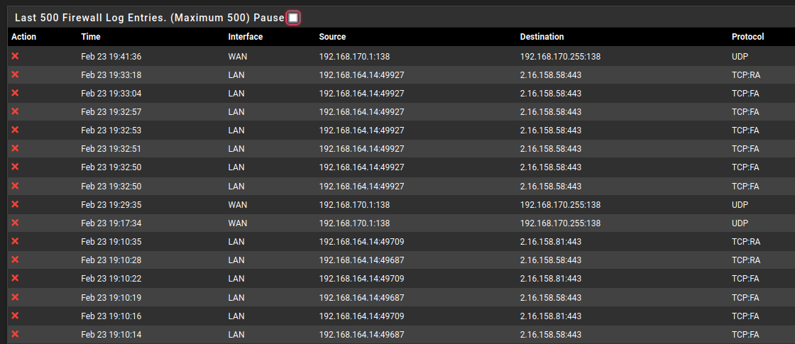
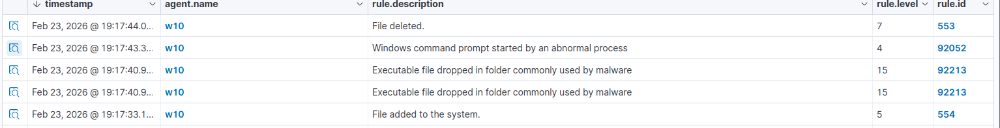

+++
title = 'Home SOC Lab: Detection, Firewall Telemetry, and Alert Automation'
date = '2026-04-15T00:00:00+05:00'
description = 'A layered home SOC environment combining Wazuh, Sysmon, pfSense, and n8n for endpoint monitoring, network visibility, and actionable alert delivery.'
discipline = 'cybersecurity'
status = 'completed'
technologies = ['Wazuh', 'Sysmon', 'pfSense', 'n8n', 'Docker', 'Ubuntu', 'Windows 10']
topics = ['cybersecurity-learning']
featured = true
weight = 10
aliases = ['/projects/installing-and-setting-up-wazuh/']
+++

## Overview

This lab brings endpoint telemetry, firewall events, and alert delivery into one practical SOC workflow. Wazuh provides centralized monitoring, pfSense adds network-level visibility and control, Sysmon enriches Windows process data, and n8n forwards higher-priority alerts to Discord.

The environment was validated with file-integrity tests and a controlled malware exercise. The malware report describes the sample as Zeus while recording a Windows Defender identification of `TrojanDropper:Win32/Sirefef.gen!B`; this case study preserves that distinction rather than treating the family attribution as independently confirmed.

## Objectives

- Centralize Linux, Windows, and firewall security events.
- Monitor important Linux paths with real-time file integrity monitoring (FIM).
- Forward pfSense logs to Wazuh for network and policy visibility.
- Capture detailed Windows process and connection telemetry with Sysmon.
- Reduce notification noise and deliver alerts with a Wazuh-to-n8n workflow.
- Exercise a structured detection and incident-response process in an isolated VM.

## Environment and architecture

The lab ran in VMware with an Ubuntu 24.04 Wazuh manager, an Ubuntu 24.04 agent, and a pfSense 2.7 firewall. The internal network used the `192.168.164.0/24` range; the manager was at `192.168.164.2` and pfSense used `192.168.164.1` on its LAN interface. A separate Windows 10 analysis VM, recorded as `192.168.164.14`, was placed behind pfSense and enrolled in Wazuh.

```text
Windows 10 + Sysmon ──Wazuh agent──┐
Ubuntu 24.04 agent ──Wazuh agent───┼──> Wazuh manager/dashboard
pfSense 2.7 ──Syslog/UDP 514────────┘             │
                                                   └──> alerts.json
                                                         │
                                                         v
                                                   n8n webhook
                                                         │
                                                   level > 3
                                                         │
                                                         v
                                                      Discord
```

## Tools

- **Wazuh:** manager, dashboard, agents, FIM, decoding, and alerting
- **Sysmon:** Windows process-creation and network-connection telemetry
- **pfSense CE 2.7.2:** firewall policy, traffic logging, and egress control
- **syslog-ng:** pfSense log forwarding
- **n8n and Docker:** alert parsing, filtering, and workflow automation
- **Discord webhooks:** notification delivery
- **Windows Defender and VirusTotal:** initial blocking and hash-based context during the controlled malware test

## Implementation

### Endpoint monitoring

The Wazuh manager and dashboard were installed on Ubuntu, followed by agent enrollment for Linux and Windows systems. On Linux, the agent configuration at `/var/ossec/etc/ossec.conf` was updated to enable real-time monitoring for important directories. Creating and editing `/etc/test.txt` confirmed that FIM events reached Wazuh after the agent restarted.

Sysmon was installed on the Windows VM with a customized configuration to expose process creation and network activity beyond the default Windows event set.



*The Wazuh dashboard confirmed that the Ubuntu endpoint was enrolled and active.*



*Creating and modifying `test.txt` produced the expected file-added and file-modified events.*

### Firewall telemetry

pfSense was configured with WAN and LAN interfaces and restrictive administrative access. The report also documents DNS-based Facebook blocking and country-based filtering with pfBlockerNG.

For SIEM integration, syslog-ng listened on the pfSense LAN and loopback interfaces. Remote logs were routed to a syslog destination, while Wazuh was configured to receive UDP traffic on port `514`. Existing Wazuh decoders and rules then made the firewall events searchable as alerts.



*The pfSense console after initial interface assignment. The report notes that the LAN address shown here was later changed to `192.168.164.1`.*

### Alert automation

n8n ran in a Docker container and exposed a local workflow endpoint on port `5678`. A webhook accepted Wazuh alert data, a transformation step retained the alert level, ID, description, timestamp, and agent, and a filter passed only alerts above level 3. A POST request node formatted the remaining events for a Discord webhook.

A Python forwarding script read `/var/ossec/logs/alerts/alerts.json` and submitted new alerts to the n8n listener. The report records successful Discord delivery after the workflow and forwarder started.



*The workflow reduced the incoming Wazuh payload to the fields needed for notification and triage.*



*The completed path delivered level-6 executable-drop alerts for agent `w10` to Discord.*

### Controlled detection exercise

A Windows 10 VM behind pfSense was used to execute the sample in a controlled environment. Windows Defender initially blocked the download as `TrojanDropper:Win32/Sirefef.gen!B`; real-time protection was temporarily disabled for the lab exercise. The recorded file was:

```text
invoice_2318362983713_823931342io.pdf.exe
MD5: EA039A854D20B7734C5ADD48F1A51C34
```

The test was monitored at both the endpoint and network layers. The incident plan called for isolating the VM, blocking observed destinations, removing the executable and temporary artifacts, checking registry run keys, restoring the clean snapshot dated February 23, 2026, re-enabling Defender, and watching for repeat alerts.

## Findings

Wazuh recorded three notable behaviors:

- Rule `554`: a file was added to the system.
- Rule `92213`: an executable was dropped in a folder commonly used by malware.
- Rule `92052`: Windows Command Prompt was started by an abnormal process.

pfSense logged denied TCP/443 connections to `2.16.158.58` and `2.16.158.81`. The reports interpret these as attempted command-and-control traffic; the firewall denial demonstrated that endpoint compromise did not automatically grant outbound connectivity.



*pfSense recorded repeated deny actions from the analysis VM, including TCP/443 attempts to the destinations documented in the report.*



*The Wazuh timeline places file creation, executable-drop, abnormal Command Prompt, and deletion events in a single view.*

## Challenges

- Real-time FIM required an explicit configuration change and agent restart.
- Firewall events crossed several components—pfSense logging, syslog-ng routing, UDP ingestion, and Wazuh decoding—so each hop had to be validated.
- Raw Wazuh output was too noisy for chat delivery; filtering at alert level greater than 3 made the workflow usable.
- Defender blocked the sample before behavior could be observed, requiring a deliberately isolated environment and a clean recovery point before protection was changed.
- The source reports use different family labels for the test sample, so behavioral evidence and recorded detections are more reliable here than a definitive malware-family claim.

## Results

The lab produced a working monitoring path from endpoints and the firewall into Wazuh, plus a working notification path from Wazuh through n8n to Discord. The FIM test generated real-time file events, pfSense alerts were decoded in Wazuh, and the controlled malware run produced both host-level rules and denied network connections.

These are validation results from a home lab. The reports do not provide production-scale performance data, false-positive rates, or measured response-time improvement.

## Lessons learned

- Endpoint and network telemetry answer different parts of the same investigation.
- Egress controls remain valuable after an endpoint process has already executed.
- Alert delivery should be filtered and contextualized before it reaches a human channel.
- Snapshots, isolation, and a written recovery sequence are prerequisites for safe malware testing.
- When tooling disagrees on attribution, preserve the observable evidence and qualify the label.

## Original reports

- [Wazuh installation and FIM monitoring](/files/case-studies/wazuh-installation-itsolera.pdf)
- [pfSense installation and Wazuh integration](/files/case-studies/pfsense-installation-itsolera.pdf)
- [Wazuh and n8n integration](/files/case-studies/wazuh-n8n-integration-itsolera.pdf)
- [Malware detection and incident-response plan](/files/case-studies/malware-detection-itsolera.pdf)
