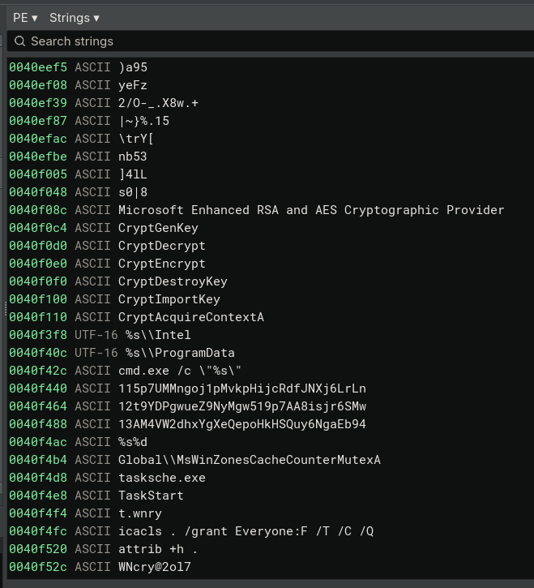
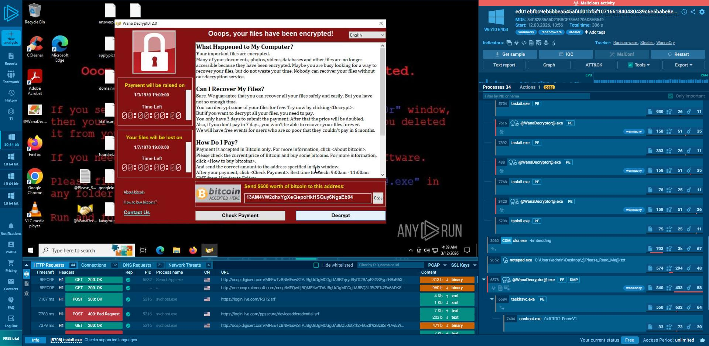
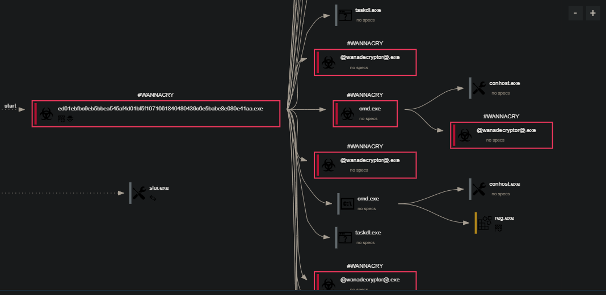
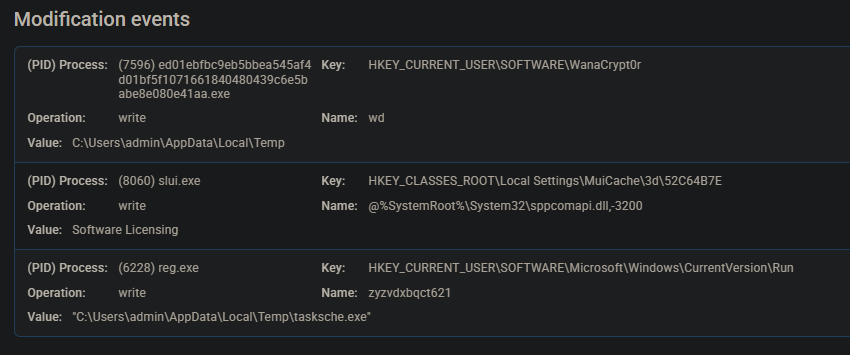
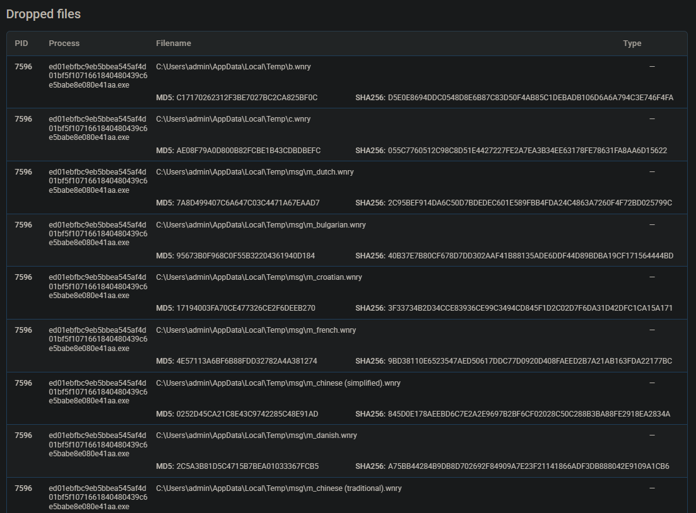

+++
title = 'WannaCry Malware Analysis'
date = '2026-07-24T00:00:00+05:00'
description = 'Static and dynamic analysis of a WannaCry sample in an isolated Windows environment, with correlated process, file, registry, and network evidence.'
discipline = 'cybersecurity'
status = 'completed'
technologies = ['ANY.RUN', 'Binary Ninja', 'ProcMon', 'Process Explorer', 'FakeNet-NG', 'Regshot', 'Windows 10']
topics = ['Malware Analysis', 'Ransomware', 'Incident Response']
featured = true
+++

## Overview

This analysis examined a WannaCry sample with static inspection and interactive sandbox observation. The work focused on what the binary appeared capable of, which behaviors were observed at runtime, and how those findings translate into defensible detection and response actions.

```text
SHA-256: ed01ebfbc9eb5bbea545af4d01bf5f1071661840480439c6e5babe8e080e41aa
Target: Windows 10 Professional, build 19044, 64-bit
```

## Objectives

- Identify meaningful strings, imports, and other static indicators.
- Observe the process tree, filesystem changes, registry activity, and network behavior.
- Correlate static capabilities with runtime evidence.
- Produce detection, containment, eradication, and recovery actions grounded in the observed sample.

## Environment and architecture

The local target was a Windows 10 guest in VirtualBox with a host-only adapter to prevent access to the physical host or external network. A clean snapshot and Regshot baseline were created before execution.

ANY.RUN supplied the interactive analysis environment used to trigger components and observe secondary payloads. The report also records FakeNet-NG for simulated network responses, ProcMon for high-frequency system calls, and Process Explorer for the live process tree.

```text
Sample
  ├── static inspection ──> imports, strings, timestamp, entropy
  └── isolated execution
        ├── process and file activity
        ├── registry persistence
        └── simulated network observation
```

## Tools

- **Binary Ninja:** disassembly, strings, cryptographic imports, and the import table
- **ProcMon:** system calls and file-permission changes
- **Process Explorer:** parent-child process relationships
- **FakeNet-NG:** simulated DNS and HTTP services
- **ANY.RUN:** interactive execution and consolidated telemetry
- **Regshot:** pre-execution system baseline

## Implementation

Static analysis was performed before execution. The binary carried a `2010-11-20 09:05:05` timestamp, which the report treats as inconsistent with the 2017 WannaCry lineage, and contained high-entropy sections suggestive of packing. Imports included `CryptGenKey`, `CryptDecrypt`, and `CryptEncrypt`.

Hardcoded strings exposed preparation commands:

```text
icacls . /grant Everyone:F /T /C /Q
attrib +h .
```



*Static inspection exposed CryptoAPI functions, the Microsoft cryptographic provider, task utilities, and the embedded `icacls` command.*

The first recursively grants full access to files in the current directory; the second hides the working directory. The string `Global\\MsWinZonesCacheCounterMutexA` was identified as an infection marker intended to prevent repeat execution on the same host.

The sample was then run interactively. The main payload launched `cmd.exe`, multiple `@WanaDecryptor@.exe` instances, cleanup utilities, and registry tooling. Runtime evidence was compared with the earlier static findings.



*The interactive sandbox captured the ransom interface alongside the process list and network telemetry.*

## Findings

### Process execution

The report recorded this execution chain:

1. The main sample started as PID `7596`.
2. It spawned `cmd.exe` as PID `4564` for hidden batch commands.
3. Multiple `@WanaDecryptor@.exe` processes ran under PIDs `6576`, `2692`, and `6064`.
4. `taskdl.exe` ran as PID `3340` for cleanup.
5. `reg.exe` ran as PID `6228` and modified Autorun values.



*The process graph connects the initial sample to `@WanaDecryptor@.exe`, `cmd.exe`, `conhost.exe`, and cleanup activity.*

### Files and persistence

The sample used the temporary directory to stage `.wnry` components. The report also records writes to the Word startup and Chrome extension directories, plus Autorun changes intended to relaunch ransomware components after reboot.



*Runtime telemetry captured a WannaCryptor value and a `CurrentVersion\Run` entry pointing to `tasksche.exe`.*



*The dropped-files view records `.wnry` components and supporting executables created during the session.*

### Network behavior

The sandbox showed indicators of Tor use. The report interprets this activity as infrastructure intended to obscure command-and-control destinations; it does not document a confirmed external controller reached from the isolated local VM.

### Static-to-dynamic correlation

| Static evidence | Runtime evidence | Supported conclusion |
| --- | --- | --- |
| `icacls` command string | The main process called `icacls.exe` | The sample changed file permissions |
| CryptoAPI imports | Large-scale creation of `.wnry` files | Cryptographic capability aligned with ransomware file activity |
| Task and persistence strings | Autorun values were added | Persistence behavior occurred at runtime |

## Challenges

- Ransomware execution required strict separation from the host and a reliable rollback point.
- Packed or high-entropy sections limited what static analysis alone could establish.
- Simulated connectivity reveals attempted behavior but does not prove that a real command-and-control endpoint was contacted.
- Process names vary between the narrative and screenshots, making behavior and hashes stronger identifiers than filenames alone.

## Results

The exercise connected static indicators to observed process, registry, file, and network behavior. It confirmed permission changes, ransomware component execution, `.wnry` staging, and persistence-related registry activity within the analysis environment.

The report does not claim successful decryption, recovered user data, or measurement of propagation across multiple hosts.

## Lessons learned

- Static strings become substantially more useful when tied to a runtime event.
- Process ancestry and command-line monitoring can surface ransomware preparation before encryption is complete.
- Creation of `.wnry` files and unusual `icacls /grant Everyone:F` activity are practical detection opportunities for this sample.
- Containment should isolate the affected VLAN or host and disable SMBv1 to reduce the family’s known lateral-movement path.
- Recovery should rely on a clean reimage and offline backups, not the ransomware’s bundled decryptor.

## Original report

[View the complete WannaCry analysis PDF](/files/case-studies/wannacry-analysis-itsolera.pdf)
